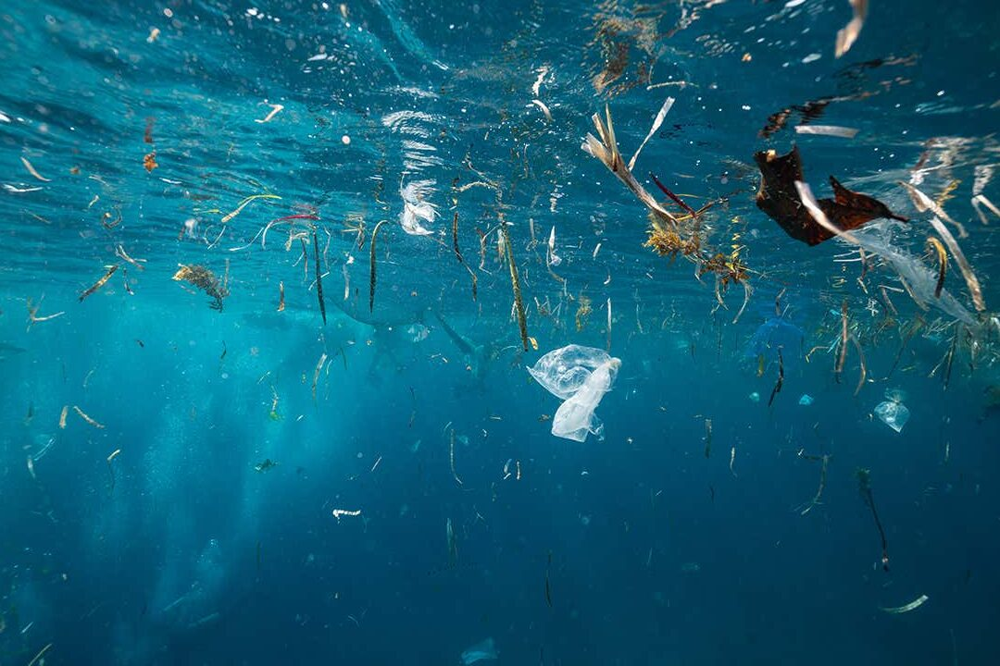

# Océan Rouge

<!-- Bannderole / Bande-annonce -->

## Description

Le site présente notre installation interactive <b>Océan Rouge</b>, en incluant de façon détaillée la conception de celle-ci. On peut aussi y retrouver la description des membres ayant participé à la concrétisation du projet.

#### Résumé projet

Notre projet se nomme Océan Rouge. Il s’agit d’une installation multimédia dont le but est de transmettre et de créer un mouvement collectif engendrant des changements positifs pour l’ensemble des êtres vivants.

Nous souhaitons faire ressentir aux interacteurs de notre projet la sensation de faire partie d’un mouvement de sauvetage de la flore et la faune marine.

Le son de notre projet soutiendra ce message à travers une sonorité sombre, créant ainsi un sentiment d’urgence incitant l’interacteur à agir pour sauver un espace agonisant.

<!-- Présentation de ce qu'est ce site et résumé du projet en un paragraphe, toujours à jour-->
