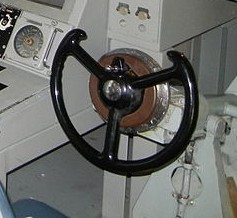
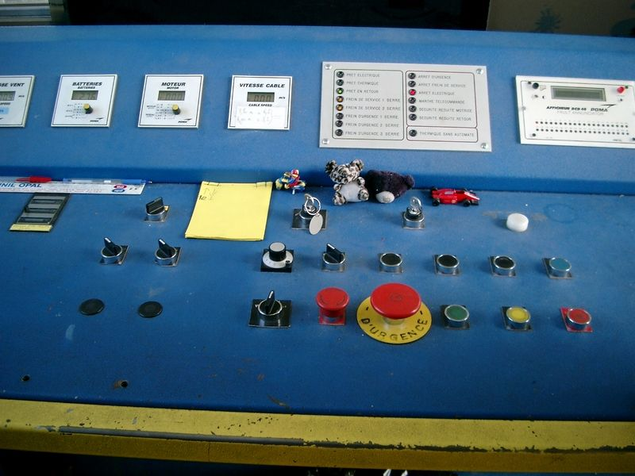
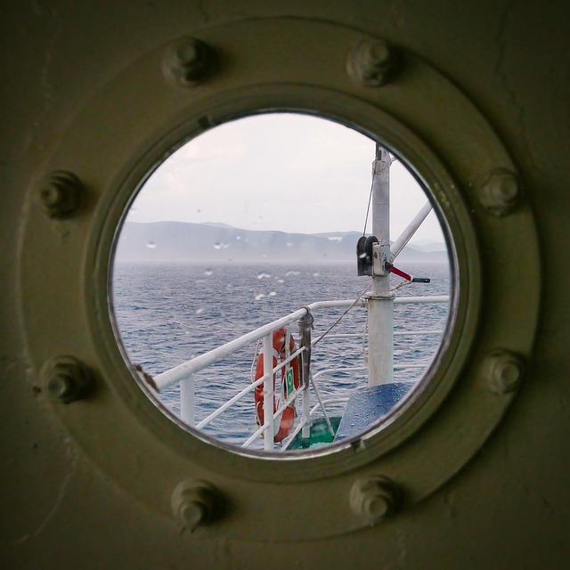
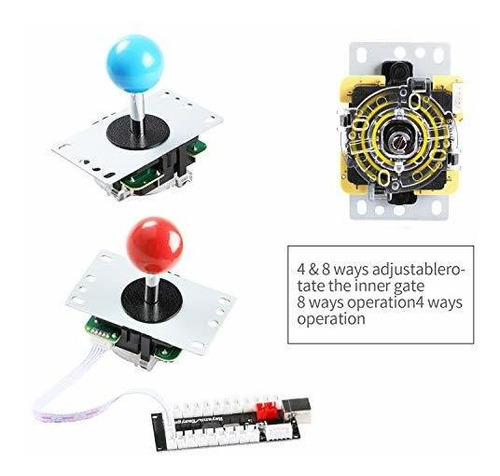
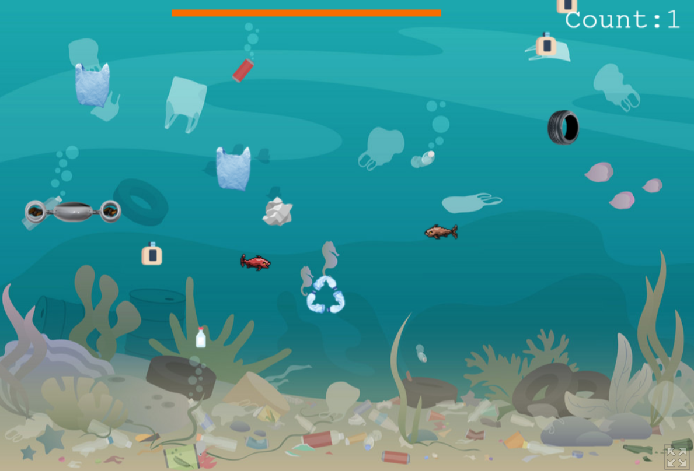
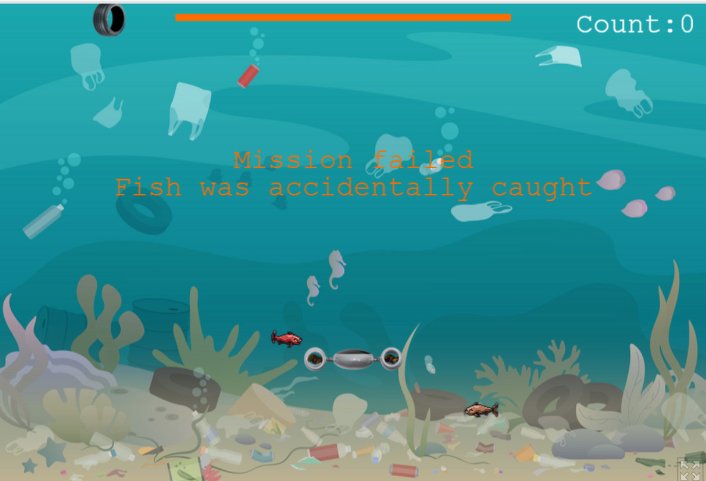
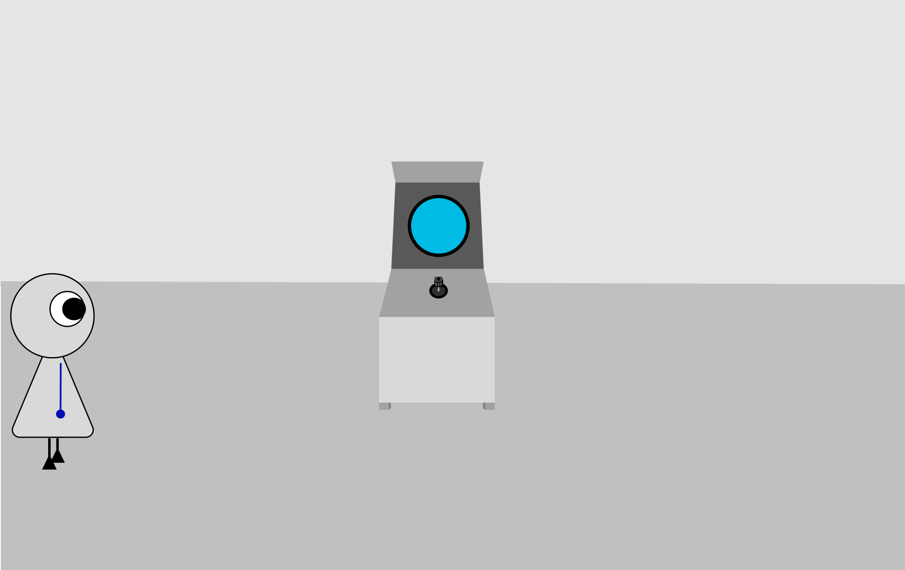
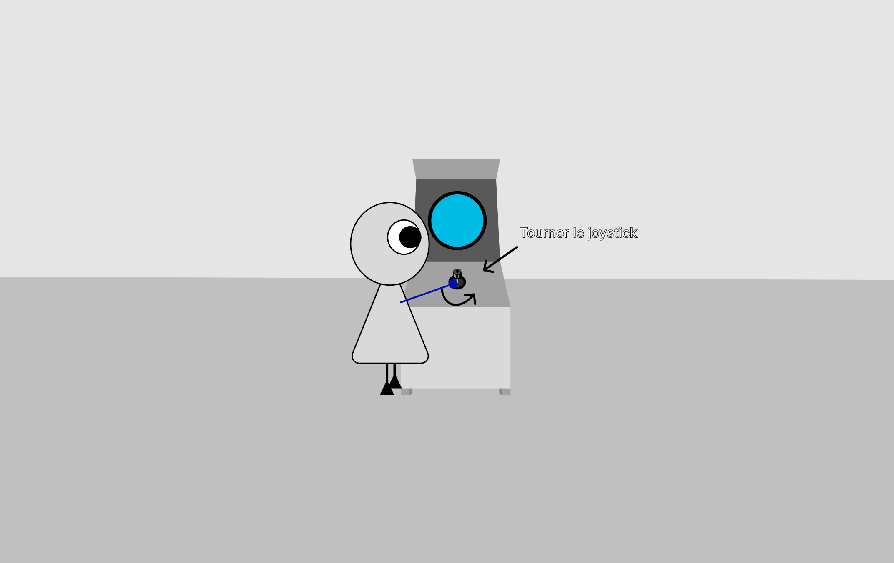
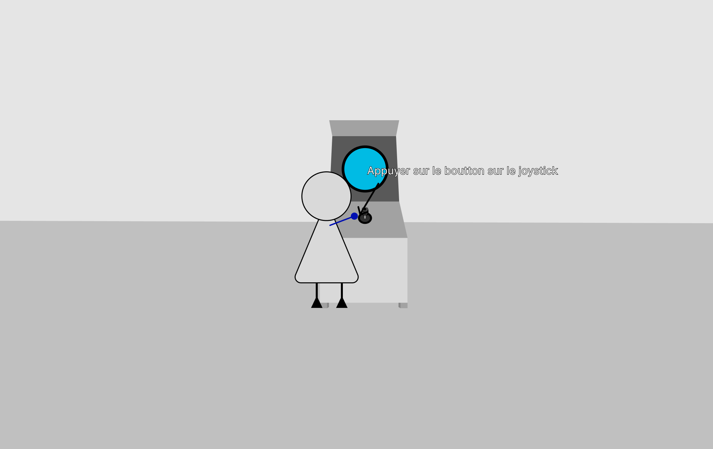
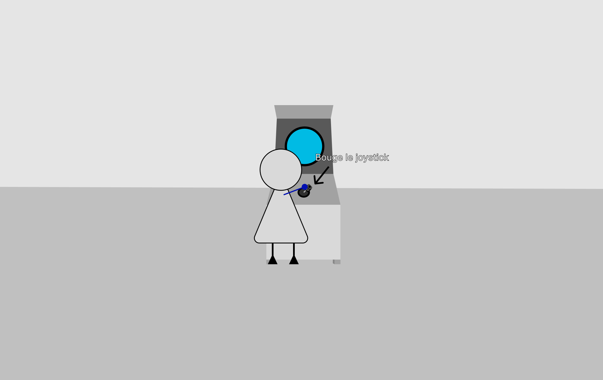

# Concept

## Le pitch initial

<!-- Inclure la vidéo du PowerPoint intial -->

<!-- Intégration d’une vidéo : méthode 1 (vidéo hébergée sur YouTube, pouvant être non répertoriée publiquement)
-->
<!-- 

-->

<!-- Intégration d’une vidéo : méthode 2 (vidéo locale)
 -->
<!-- 
 
-->

## L'expérience

### Le parcours de l'interacteur

<!-- 
Comportement de l’interacteur
Qu'est-ce que fait l'interacteur?
un résumé du parcours de l'interacteur du début à la fin de son expérience - qu'est-ce qu'il fait, qu'est-ce qu'il manipule, etc
-->

L’interacteur avance vers le panneau de contrôle, situé sur une table. Ce panneau comprend deux joysticks, chacun équipé d’un bouton d’activation. Au centre de la paire de joysticks se trouve un volant de sous-marin. Sur la partie surélevée de la table se trouve une fenêtre hublot, derrière laquelle est placé un écran. À travers cette fenêtre, le visiteur observe des déchets dérivant dans un océan déserté. Cette situation de pollution s’accompagne d’une ambiance sombre, incitant les interacteurs à agir avec un sentiment de culpabilité face à la catastrophe.

À l’aide du volant, l’interacteur peut déplacer horizontalement le sous-marin en le faisant pivoter sur l’axe des X. Les joysticks permettent de contrôler les viseurs, qui déterminent l’endroit où le bras mécanique sera activé ; ce bras peut être déplacé sur les axes X et Y. Pour activer le bras mécanique, l’interacteur doit appuyer sur le bouton d’activation. Afin de faciliter le nettoyage des obstacles, trois visiteurs peuvent travailler simultanément en équipe, évitant ainsi que les déchets continuent de s’accumuler au fond de l’océan. Les déchets présents au fond disparaissent après un certain délai. Une fois tous les déchets éliminés — en empêchant de nouveaux déchets d’atteindre le fond et en laissant ainsi les déchets déjà présents disparaître complètement — les visiteurs sont récompensés par des sons et des visuels harmonieux, symbolisant le retour à la vie de l’écosystème marin.

### La progression

<!--  sur le temps et la progression -->

Les interacteurs ont le pouvoir de manipuler le visuel à l’aide d'un volant, de joysticks et de boutons d’activation (objets physiques) afin d’atteindre leur objectif : éliminer la pollution.

En ce qui concerne la progression, l’interacteur est invité à manipuler un joystick et son bouton associé (objets physiques) sur le panneau de contrôle, ou encore à utiliser un volant. Ces manipulations de l’interface réelle influencent directement l’environnement virtuel. Le viseur du bras mécanique du sous-marin, affiché à l’écran, se déplace à l’aide des données fournies par un encodeur (objet physique représenté par un joystick). Lors de sa manipulation, un son mécanique étouffé accompagne la sensation de solitude de l’océan. Les visiteurs peuvent activer le bras mécanique à l’aide d’un bouton situé près de chaque joystick. En appuyant sur ce bouton, un son éclatant résonne dans les profondeurs de l’océan. Ce bouton permet de retirer les déchets situés dans la zone de détection, c’est-à-dire à l’endroit où la pince du bras du sous-marin entre en contact avec un obstacle. Le sous-marin pivote sur l’axe des X à l’écran grâce aux données d’angle transmises par un encodeur (objet physique représenté par un volant). La manipulation de ce dernier déclenche un son de déplacement de l’eau, accompagné de bulles.

Un maximum de trois interacteurs peut participer simultanément à l’expérience : deux joysticks, deux boutons et un volant composent l’interface de l’environnement réel. Ensemble, les interacteurs peuvent plus facilement empêcher les déchets d’atteindre le fond de l’océan et ainsi laisser le tas de déchets déjà présent disparaître de lui-même. Une fois celui-ci entièrement disparu, une animation paisible et victorieuse représentant la réapparition des créatures marines, accompagnée d’une ambiance sonore harmonieuse, se déclenche. Après un délai de 30 secondes, un fondu (« fade out ») ramène l’installation à son état initial — les déchets recommencent à couler — permettant ainsi à d’autres visiteurs d’interagir avec l’œuvre.

### L'espace

<!-- 
description de l'espace réel et virtuel du projet et comment l'espace réel est transposé, transorté ou prolongé dans le virtuel et inversement 
-->

Notre installation est située dans le grand studio de notre programme Techniques. Le projet partagera l’espace avec d’autres installations voisines. Nous réserverons donc une zone du studio suffisamment grande pour accueillir jusqu’à 3 personnes à la fois, afin qu’elles puissent participer à l’expérience. Donc, environ 1 mètres de longueur 2 mètres de largeurs.

#### L'espace virtuel

L’espace virtuel (affiché sur un écran) représente un océan dont le sol est pollué, composé d’environnements de style 2D simple (algues, paysages du fond marin). Les déchets, qui coulent vers le fond de l’océan, prennent une couleur sombre et alarmante ainsi qu’une forme peu reconnaissable à l’œil, perturbant l’environnement. Les créatures marines, quant à elles, sont représentées sous forme de silhouettes d’un bleu foncé, afin de refléter leur cohérence avec leur habitat naturel.

#### L'espace tangible

L’espace réel se compose d’un panneau de contrôle situé sur une table, invitant les interacteurs à manipuler les joysticks et les boutons de l’installation ou à manipuler un volant. Chaque joysticks et chaque bouton sont identifiés par un numéro, permettant de distinguer les interacteurs et la pince qui leur est associée à l’écran. Les visiteurs peuvent observer l’espace virtuel à travers une fenêtre hublot.

### L'aspect collectif

<!--
comment votre idée de projet correspond au thème du COLLECTIF
Plus il y a de personnes qui peuvent interagir simultanément est un critère important !

Un collectif désigne l'ensemble de personnes ou d'entités qui s'unissent de manière concertée pour poursuivre un objectif commun, en coopérant et en collaborant pour atteindre des buts qui seraient difficiles à réaliser individuellement.
 Il peut s'agir d'une réunion informelle ou contractuelle, temporaire ou durable, constituée autour d'une cause, d'une action ou d'un projet, qu'il soit artistique, politique, professionnel, moral ou cultuel.
 Ce groupe, souvent considéré comme une entité à vocation communautaire, fonctionne sous le pilotage de ses membres et repose sur une volonté partagée de développer des solidarités.
-->
La pollution qui s’engouffre au fond de l’océan crée un tas d’ordures qui étouffe la flore environnante. L’utilisation d’un sous-marin composé de sous-marinier permet à plusieurs bras de s’étendre et ainsi de combattre l’afflux de déchets. Dans cette expérience, les interacteurs sont encouragés à se réunir devant le hublot du sous-marin afin de sauver une partie du monde à l’agonie.

Bref, l’afflux de déchets incite les interacteurs à se rassembler pour attraper les déchets à l’aide des joysticks mises à la disposition de trois personnes, une pour chaque pince.

### L'aspect social

<!--
comment votre idée de projet correspond au thème du SOCIAL

Le terme « social » désigne ce qui concerne la vie en société, c’est-à-dire les relations entre les individus au sein d’un groupe organisé, ainsi que les structures, normes et institutions qui en découlent.
 Il peut s’appliquer à des aspects variés, comme la vie sociale, les groupes sociaux, les classes sociales, les rapports de production, ou encore les politiques visant à améliorer les conditions de vie des individus.
 En sciences sociales, le social englobe l’étude des phénomènes collectifs, des interactions humaines, des normes sociales et des dynamiques de pouvoir au sein de la société.
 L’adjectif peut aussi qualifier des animaux ou des plantes vivant en communauté selon des règles strictes, comme les insectes sociaux (fourmis, abeilles) ou certaines espèces végétales formant des colonies denses.
-->
L’aspect social de notre projet repose sur une responsabilité collective qui engendre, chez les individus, un sentiment de culpabilité lié à la participation à une action collective néfaste. La culpabilité est un sentiment humain qui fait ressentir à une personne le poids de la responsabilité d’un acte ayant causé du tort ou de la souffrance.

Nous avons choisi ce sujet parce que nous avons remarqué que le sentiment de culpabilité peut pousser des personnes, indirectement ou directement responsables, à se réunir afin d’alléger cette culpabilité et de réparer le mal qui a été fait. La réparation d’une erreur collective permet de créer une expérience favorisant la coopération entre différents individus. Cela démontre à la fois le mal et le bien qu’un groupe d’individus peut provoquer.

## Inspirations

### Inspirations visuelles

<!-- Inclure le moodboard avec référenes pour chacune des sources-->

 

#### L'ambiance de la salle et l'espace virtuel

<!-- Inclure le moodboard avec référenes pour chacune des sources -->

<!--
Images inspirantes
Représentations visuelles de l'ambiance recherchée, que ce soit à travers des photographies, des illustrations, ou des œuvres existantes.

Palette de couleurs
Choix de couleurs qui influenceront l’éclairage, les médias projetés, ou l’interface visuelle.

Références multimédia
Vidéos, musiques ou sons, séquences animées qui capturent l’énergie ou la tonalité souhaitée pour l'installation.

Textures et matériaux
Échantillons ou représentations de matériaux tangibles qui seront utilisés dans l'installation (écrans, surfaces tactiles, objets physiques interactifs).

Ambiance sonore et lumineuse
Inspirations relatives à la scénarisation de la lumière et du son, qui seront des éléments interactifs clés dans l’expérience utilisateur.
-->

### Inspirations visuelles

### Inspirations sonores

[Calm Ambient soundscape for focus Par Lilliben](calm-ambient-soundscape-for-focus-365156.mp3)
[Dark Ambient soundscape dreamscape for focus Par DELOSound](dark-ambient-soundscape-dreamscape-442836.mp3)

### Inspirations interactives

<!-- Inclure des liens et une ligne sur pourquoi -->

L'utilisation d'objets physiques pour manipuler le monde virtuel. (Enrichir l'expérience)

## Scénarimage

<!-- Pour chaque étape/scène : une image avec du texte descriptif et une explication de la transition -->

<!--
Éléments du scénarimage
Séquence visuelle
Chaque scène ou séquence du scénarimage doit être clairement illustrée, montrant les éléments visuels qui seront projetés ou affichés. Cette séquence visuelle peut inclure des captures d'écran, des croquis ou des rendus 3D, en fonction des besoins du projet.

Points d'interaction
Le scénarimage dans un cadre interactif inclut les moments où l'utilisateur interagit avec l'installation. Ces points d’interaction doivent être représentés graphiquement pour indiquer comment et quand l’utilisateur influencera la progression du récit ou des effets visuels et sonores.

Évolution du récit
Comme pour le scénario narratif, le scénarimage doit montrer la progression de l’histoire ou de l’expérience au fil des interactions. Il permet de visualiser comment l’installation évolue en fonction des actions de l'utilisateur, avec des embranchements possibles selon ses choix.

Retour visuel et sensoriel
Le scénarimage doit inclure des annotations ou des visuels montrant les réponses visuelles, sonores ou tactiles à chaque interaction. Cela peut inclure des changements d’éclairage, des transitions vidéo, ou des effets sonores qui réagissent aux actions de l’utilisateur.
-->

