# Amira Tounekti

### Semaine 1

- Faire la partie concept du site du projet (aspects visuels, palette de couleurs, médias de référence et scénarimage)
- Concevoir la page d’accueil en choisissant l’image, puis en rédigeant la description et le résumé
- Créer les fichiers de travail : Unity, Pure Data et Visual Studio Code
- Programmer dans Visual Studio Code la communication de l’encodeur, du joystick et du Key Unit vers Unity via Pure Data

### Semaine 2

- Commencer à rédiger le journal de bord
- Coder dans Unity la génération aléatoire des déchets à récolter, l’animation des déchets qui tombent, la disparition des déchets sous la condition de l’activation du bouton et de la collision avec la pompe à déchets, l’accumulation des déchets avec une limite définie par un compteur, la disparition des déchets après un certain temps au sol, ainsi que la rotation de la caméra à l’aide d’un encodeur
- Création d’un compteur pour le nombre de déchets dans la scène
- Commencer à mettre certains assets et animations
- Coder le déplacement de la pompe à déchets à l’aide du joystick autour de la comera au centre du jeu
- Documenter le code dans Unity

### Semaine 3

- Finaliser la maquette 1 (prototype du jeu – programmation dans Unity)
- Construire un contenant test des éléments (joystick, Keys Unit et encodeur)
- Implanter la première version animée des assets visuels dans Unity pour la maquette 1
- Commencer à effectuer quelques corrections de code après les commentaires des professeurs
- Classer les fichiers techniques de l’Arduino (Visual Studio Code, Unity et Pure Data)

### Semaine 4

- Commencer à mettre en place une progression visuelle (plantes et créatures qui apparaissent et ambiance qui se dégrade)
- Commencer à réparer la fluidité des mouvements
- Commencer à implanter les nouveaux médias d’animation et les visuels dans Unity
- Commencer à s’organiser pour le comité de déambulation

### Semaine 5

- Effectuer des modifications et améliorations des médias
- Implanter les sons dans Unity avec leurs interactions respectives dans le code, ainsi que les sons d’ambiance
- Remplacer le Key Unit, le joystick et l’encodeur par un joystick 4D capable de pivoter, de bouger sur les axes X et Y, et doté d’un bouton intégré sur le dessus
- Réaliser le montage de la bande-annonce
- Créer le logo du projet « Océan Rouge »
- Commencer la construction du boîtier du panneau de contrôle
- Commencer à améliorer la logique de certains composants du jeu afin d’optimiser le gameplay

### Semaine 6

- Réaliser les finitions de la maquette 2
- Rédiger la moitié du dossier de presse, de la description à la bande-annonce
- Commencer à ajouter les sons manquants et les assets dans Unity après la remise de la maquette 2
- Mettre en place un accueil avec un manuel d’instructions
- Mettre en place la possibilité de perdre et de gagner
- Mettre en place la progression de la difficulté

### Semaine 6.5

- Avancement du comité de déambulation

### Semaine 7

- Effectuer le contrôle qualité et corriger les éventuelles erreurs dans Unity, Visual Studio Code, Pure Data et sur le boîtier du panneau de contrôle
- Finaliser la mise en place des médias sonores et visuels
- Finaliser les impressions pour le comité de déambulation
- Finaliser la construction de l’arcade
- Faire les enregistrements pour la vidéo de documentation

### Semaine 8

- Présenter l’installation
- Finaliser le journal de bord
- Finir les correction dans le site 
- Réaliser le montage de la vidéo de documentation

## Journal de bord

Cette section, complétée **quotidiennement** pendant l’exécution du projet, documente le travail individuel réellement réalisé chaque jour.

<!--
- Une entrée par jour sur 8 semaines (8 semaines à partir de la semaine 2).
   - Un total d'au moins 40 entrées uniques!
- Chaque jour :
    - Documentstion visuelle et/ou sonore du travail effectué
    - Lien vers les billets GitHub résolus
- Démarche rigoureuse de validation de la qualité
- Démonstration d'autonomie.
- Exécution technique précise et complète.
- Évaluation réfléchie de la contribution individuelle au travail d’équipe.
-->

### Semaine 2

#### Lundi
- Finaliser les corrections des semaines des tâches hebdomadaires dans l’équipe
- Commencer à rédiger le journal de bord des tâches quotidiennes
- Finaliser les corrections du concept du site du projet Océan Rouge
- Coder le déplacement de la pompe à déchets (cube 3D) avec le joystick de gauche à droite dans l’axe X et Y
- Faire le code du Keys Unit dans Unity pour que Unity reçoive les données du bouton
- Coder le déplacement des déchets (sphère 3D) qui tombent vers le bas de l’écran
- Mettre en place la détection de collision entre la pompe à déchets (cube 3D) et les déchets (sphère 3D) dans Unity
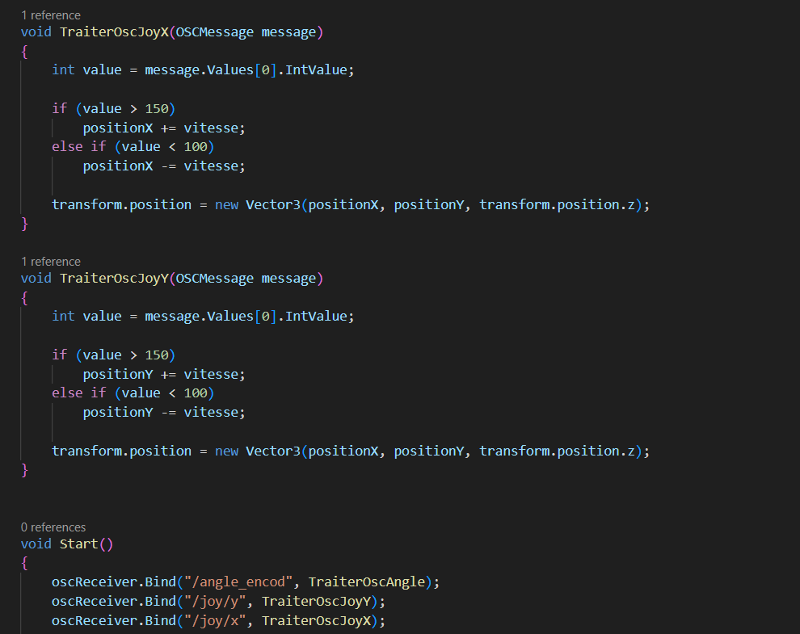

#### Mardi
- Faire tourner la caméra sur elle-même avec l’encodeur dans l’axe Y
- Coder la disparition des déchets sous la condition de l’activation du Keys Unit et de la collision entre la pompe à déchets et le déchet
- Coder la création de déchets aléatoires suivant la forme d’un cercle autour de la caméra
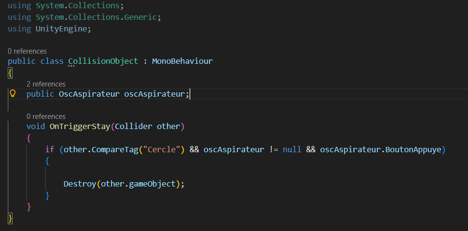
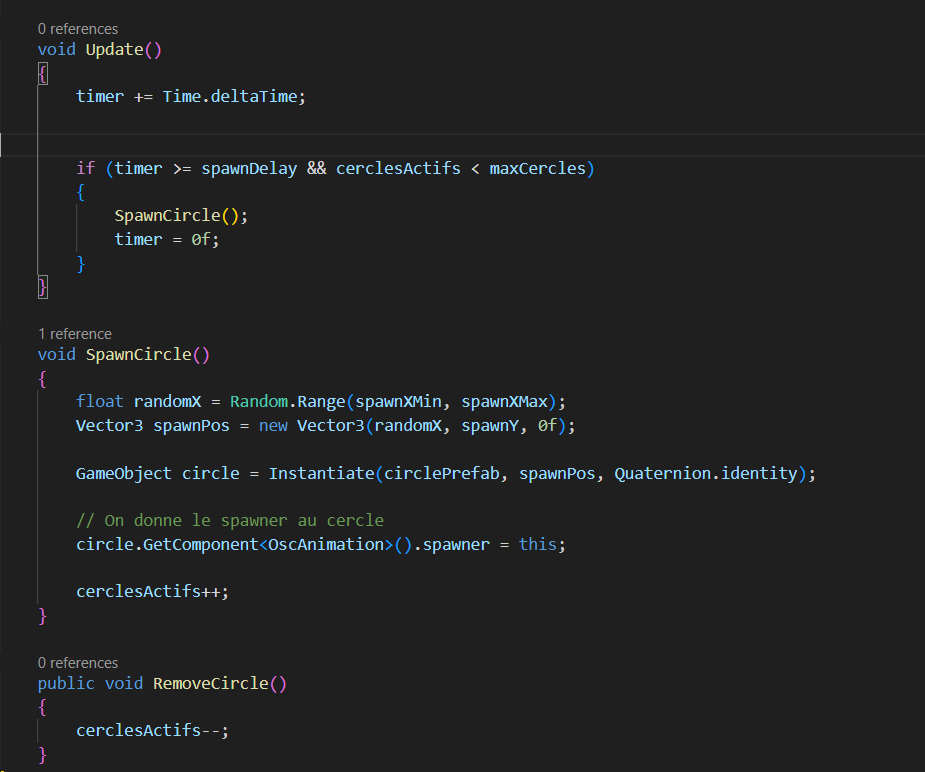

#### Mercredi
- Coder le mouvement de la pompe à déchets pour qu’il tourne autour de la caméra et se déplace librement sur l’axe Y
- Ajout d’assets de test : un sprite 2D de déchet placé dans la sphère 
- Ajout d’un sprite 2D de la pompe à déchets animé se déplaçant avec le joystick pour correspondre à l’emplacement du cube
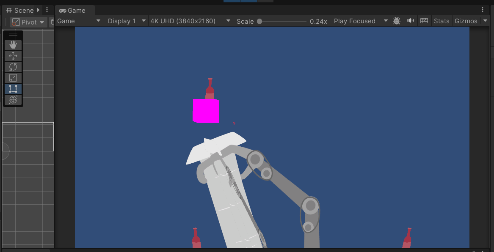

#### Jeudi
- Mettre en place un compteur pour connaître le nombre de déchets présents dans la scène 
- Coder une limite de mouvement sur l’axe Y pour la pompe à déchets
- Coder la destruction des déchets après un certain délai, déclenchée lorsque le déchet dépasse une limite sur l’axe Y
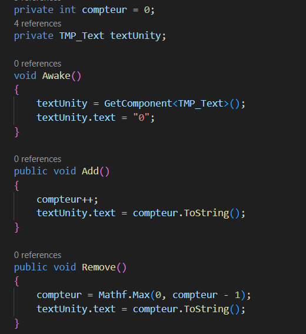

#### Vendredi
- Faire la documentation du code dans Visual Studio Code et Unity
- Coder une limite au nombre de déchets présents dans la scène, de sorte qu’après un certain nombre la génération aléatoire de déchets s’arrête
- Coder le déclenchement de l’animation du sprite 2D (la pompe à déchets) avec le bouton (Keys Unit)
- Créer une nouvelle version du jeu Unity plus propre, avec des fichiers et dossiers mieux organisés et nommés
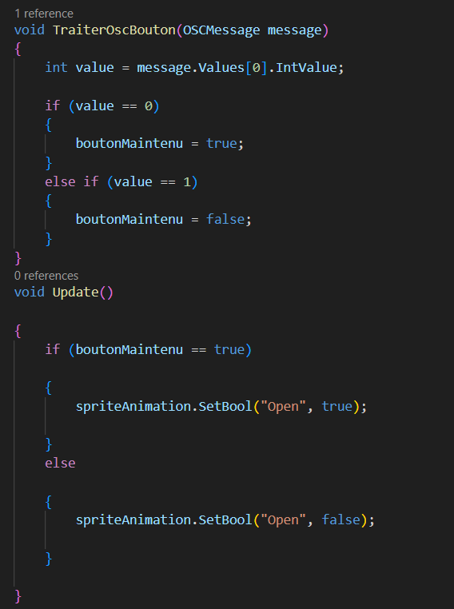

### Semaine 3

#### Lundi
- Nettoyage des scripts en simplifiant la logique de mouvement de la pompe à déchets et de la bouteille
- Classement plus propre des fichiers et des dossiers dans Unity
- Remplacement de l’asset de test du déchet par la nouvelle version animée dans Unity et ajout du code qui active l’animation du déchet avant qu’il soit détruit au sol
- Ajout d’une ligne de code dans le script DechetsScript pour que le déchet fasse toujours face à la caméra
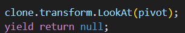

#### Mardi
- Faire en sorte que, lorsque la bouteille touche le sol, l’animation de détérioration du déchet commence
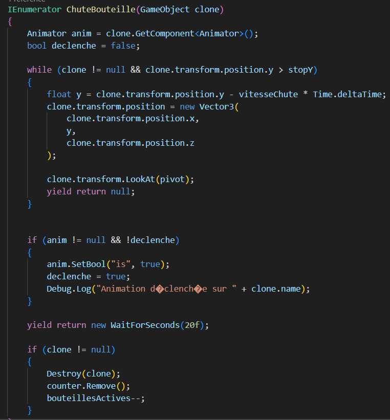

#### Mercredi
- Construire la boîte qui contiendra le bouton, l’encodeur et le joystick
- Replacer la pompe à déchets devant la caméra pour obtenir un mouvement plus réaliste
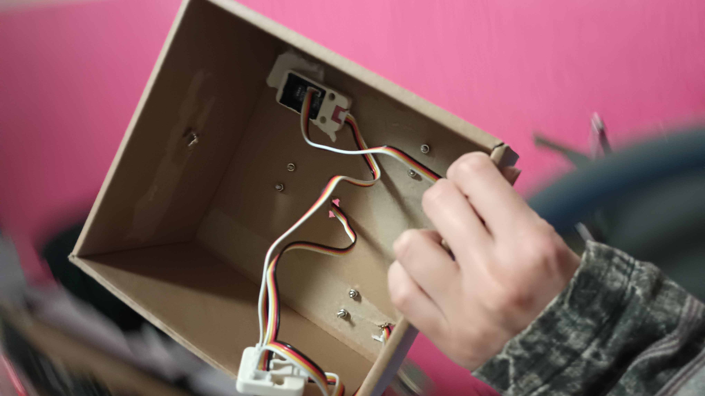
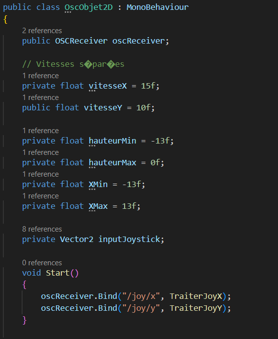

#### Jeudi
- Faire des corrections sur la maquette 1 avant la présentation aux portes ouvertes

#### Vendredi
- Ajouter les sprites animés des algues foncées et les disposer dans l’environnement autour de la caméra
- Coder une animation plus réaliste de la chute de la bouteille au fond de l’océan en faisant pivoter la bouteille lorsqu’elle touche le sol
- Mettre le dossier du projet sur GitHub

[Commit 6 Fevrier du projets ocean-rouge](https://github.com/deux-intelligence/dossier-du-projet/commit/3dc9bcb5ac0f17a6341bc35a3e953b4980fc4d71)

[Commit 6 Fevrier du projets ocean-rouge](https://github.com/deux-intelligence/dossier-du-projet/commit/7ba1d5821b0d685c47645805c3b1f4ea8ee11a56)

### Semaine 4

#### Lundi
- Ajout des algues foncées qui se retirent vers le bas en fonction du compteur
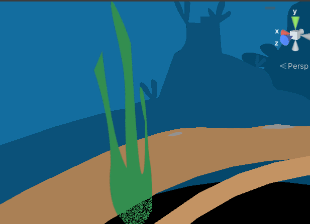
[Commit 9 Fevrier du projets ocean-rouge](https://github.com/deux-intelligence/dossier-du-projet/commit/24ff9bcdec82ba5f985f32a0a3762dc61c2643b9)

#### Mardi
- Remplacer la bouteille 2D par la bouteille 3D sans animation
- Remplacer le code de la chute des déchets par la gravité
- Ajouter les sprites de tortues animées avec leur déplacement autour du pivot
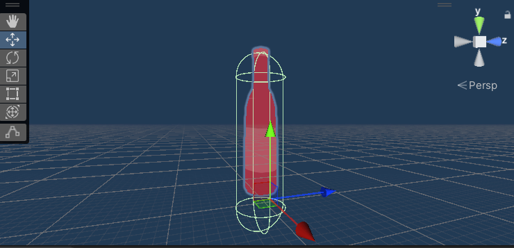
[Commit 10 Fevrier du projets ocean-rouge](https://github.com/deux-intelligence/dossier-du-projet/commit/584f1a8ee111453eedd0563acf03711560eaadf2)

#### Mercredi
- Coder la disparition des tortues vers le haut en fonction du compteur
- Ajouter l’effet de pollution dans le paysage en fonction du compteur : les trois images PNG deviennent de plus en plus visibles, le panel devient de plus en plus visible, et le paysage devient de plus en plus foncé
- Faire en sorte que la vitesse de la caméra soit plus fluide et qu’elle augmente avec la vitesse de rotation de l’encodeur
[Commit 11 Fevrier du projets ocean-rouge](https://github.com/deux-intelligence/dossier-du-projet/commit/6a99b3b959efa9846cf69a9c22fe2dbe8ae45428)

#### Jeudi
- Faire en sorte que, dans Visual Studio Code, l’encodeur réceptionne mieux les changements
- Mettre le nouveau bras kinesthésique et coder son mouvement au point d’ancrage, ainsi que son mouvement de droite à gauche de la pompe à déchets
- Remplacer l’activation de l’animation d’aspiration de l’ancien pompe à déchets par celle du nouvel pompe à déchets kinesthésique
- Création d’un groupe de conversation sur Teams pour tous les membres du comité

[Commit 12 Fevrier du projets ocean-rouge](https://github.com/deux-intelligence/dossier-du-projet/commit/26d0a8f2f5a5c4d5ffe7335aa2df3d1ae5fd41a2)

#### Vendredi
- Planification pour la construction
- Alignement de la pompe à déchets 2D avec le viseur 3D (cube)
- Ajouter des poissons avec leurs mouvements autour du point d’ancrage et définir leurs conditions d’apparition
- Mise en place de la prochaine rencontre du comité de déambulation de la semaine 5 pour lundi
[Commit 13 Fevrier du projets ocean-rouge](https://github.com/deux-intelligence/dossier-du-projet/commit/5ece87617ceacbbe9476f30ef2ca39d01a2cf677)

### Semaine 5

#### Lundi
- Ajout de deux autres déchets (shampoing et canette) afin d’avoir trois déchets qui apparaissent aléatoirement dans la scène
- Ajout des algues claires dans la scène avec leurs conditions d’apparition
- Ajout des sons (atterrissage de la bouteille, aspiration, disparition du déchet, son d’ambiance sombre) dans la scène avec leurs conditions d’apparition
- Démarrage de l’impression 3D du support pour le cartel destiné au comité de déambulation
[Commit 15 Fevrier du projets ocean-rouge](https://github.com/deux-intelligence/dossier-du-projet/commit/d208df99de2060ccaf813d08c3b953f13f594a61)
[Commit 16 Fevrier du projets ocean-rouge](https://github.com/deux-intelligence/dossier-du-projet/commit/6fb30273fe47aea0a7eec6daef94a2f12c6e7b61)

#### Mardi
- Modification du viseur circulaire pour le remplacer par un laser sous forme de cylindre allongé, suivant les axes X et Y, allant de la pompe à déchets jusqu’au déchet
- Codage de la modification de la position et de la taille du déchet lorsqu’il est aspiré, afin qu’il entre correctement dans la pompe à déchets
- Prise de mesures de la largeur et de la longueur du bois pour le panneau de contrôle (mince et épais), ainsi que pour le cadre de l’écran, puis découpe afin de correspondre aux nouvelles dimensions
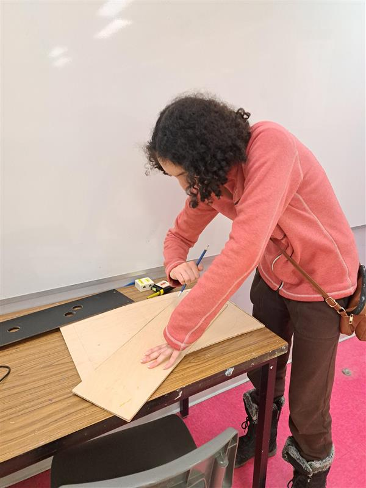
[Commit 17 Fevrier du projets ocean-rouge](https://github.com/deux-intelligence/dossier-du-projet/commit/a412c8211e8cd62da959f4d31b3935c4733c8f0a)

#### Mercredi
- Prise de mesures du cercle et découpe du panneau en bois mince pour faire passer le joystick dans un trou rond centré au milieu
- Prise de mesures d’un carré suffisamment large pour laisser passer le joystick dans le panneau en bois épais
- Codage des données du joystick dans Unity afin d’adapter le code aux nouvelles informations apportées par le joystick 4D (rotation de la caméra, mouvement de la pompe à déchets et bouton déclenchant l’aspiration)
- Remplacement des sons d’aspiration et de mouvement du sous-marin par une version corrigée et améliorée
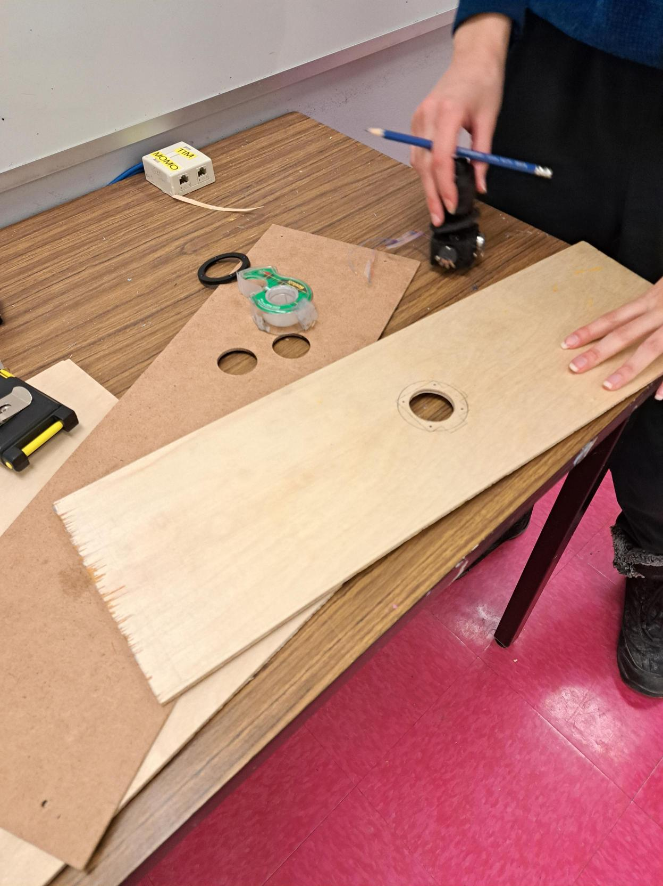
[Commit 18 Fevrier du projets ocean-rouge](https://github.com/deux-intelligence/dossier-du-projet/commit/b1d10dfece9aef8c50e0028fa5738ac01a98a891)
[Commit 18 Fevrier du projets ocean-rouge](https://github.com/deux-intelligence/dossier-du-projet/commit/f785a2112240cfd638494b09d99916ea67f00c36)

#### Jeudi
- Calcul de la position et perçage des quatre vis qui maintiendront le joystick (du haut vers les trous situés en bas du joystick)
- Calcul de la position des trous sur le panneau de contrôle mince et perçage afin de pouvoir l’aligner plus tard avec le panneau de contrôle épais et l’arcade
- Application de la peinture noire sur le panneau de contrôle mince
- Codage d’une limitation du nombre de fois où l’animation et le son d’aspiration, ainsi que la destruction du déchet, peuvent se produire, en fonction du temps pendant lequel le bouton reste appuyé (une fois pour chacun)
- Création d’un nouveau pivot vers lequel se dirigera le déchet lorsqu’il sera aspiré ; ce nouveau GameObject (pivotAspiration) remplacera la pompe à déchets
- Redesign d’une nouvelle version du logo de notre projet pour la maquette 2
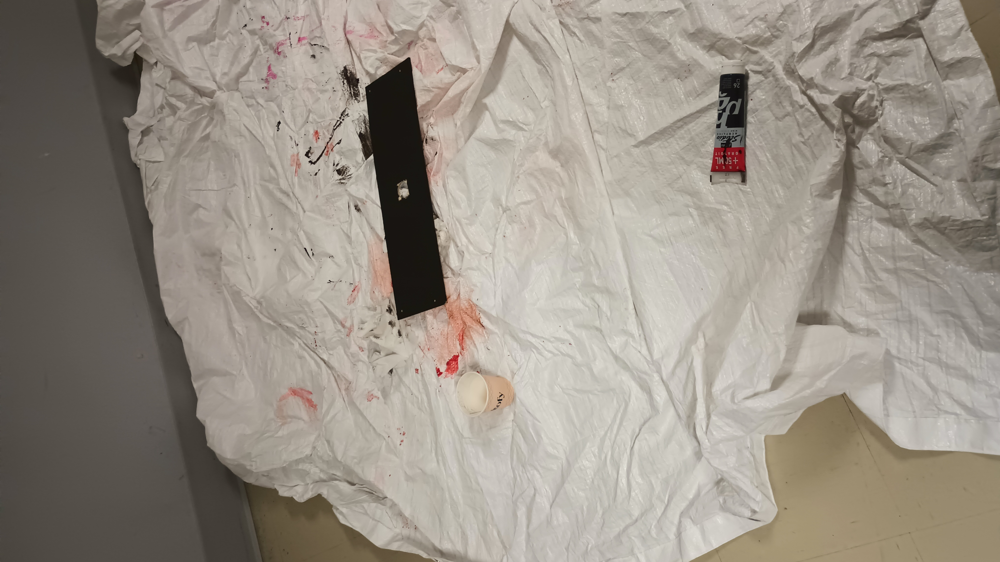
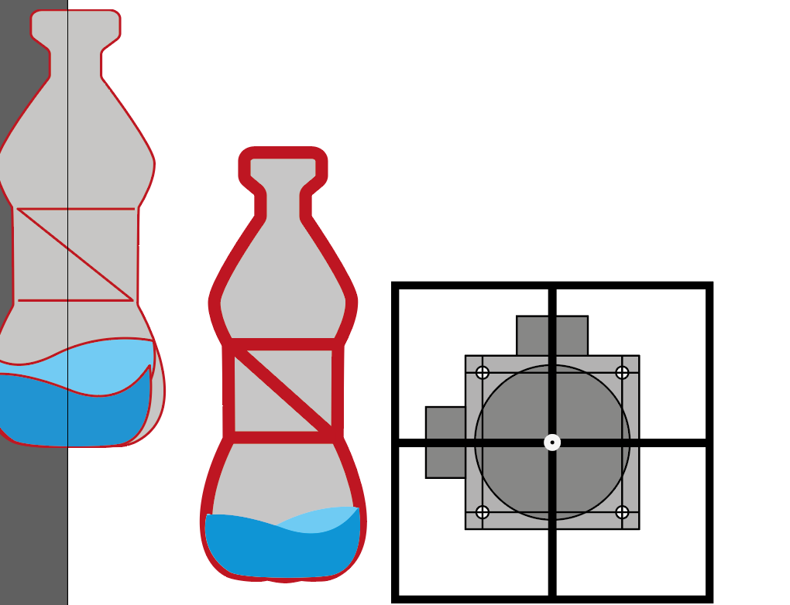
[Commit 19 Fevrier du projets ocean-rouge](https://github.com/deux-intelligence/dossier-du-projet/commit/10ee4224ade88f39c4101ba76502f27b6f56d1fc)

#### Vendredi
- Positionner le joystick dans le panneau de contrôle mince et ajuster sa façade. Ajouter également la façade du terminal Arduino sous le panneau de contrôle épais. Enfin, assembler le tout avec le cabinet d’arcade
- Effectuer quelques réparations sur le nombre maximal de déchets et sur le visuel dans le canvas, puis réaliser un build et tester dans l’arcade
- Réaliser le montage vidéo et sonore de la bande-annonce
[Commit 20 Fevrier du projets ocean-rouge](https://github.com/deux-intelligence/dossier-du-projet/commit/673c92642ec7dce395c018bef4319979564d1649)
[Commit 20 Fevrier du projets ocean-rouge](https://github.com/deux-intelligence/dossier-du-projet/commit/65911ff4c85998f2590e3baed573605e7c9141e4)
[Commit 20 Fevrier du projets ocean-rouge](https://github.com/deux-intelligence/dossier-du-projet/commit/cb0bb4ee128fa264fea991c9ae7fcf8a8b7440a2)
[Commit 20 Fevrier du projets ocean-rouge](https://github.com/deux-intelligence/dossier-du-projet/commit/8a7a8ddd178fa243cac1cd78895a6980f6d02a2c)
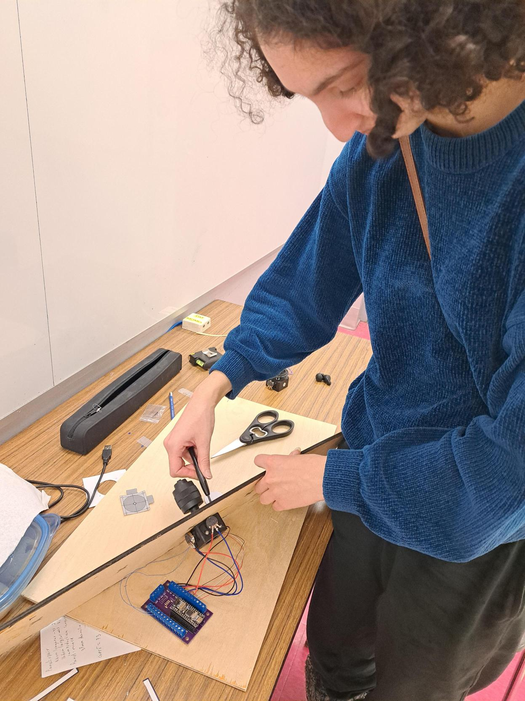
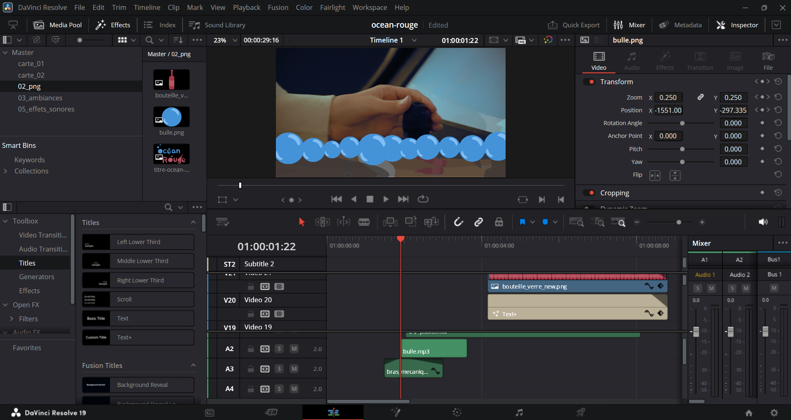

### Semaine 6

#### Lundi
- Finir les 6 impressions 3D des supports pour le cartel du comité de déambulation
- Ajouter des descriptions dans la bande-annonce
- Remplir la partie « Histoire » du dossier de presse
- Intégrer la bande-annonce à l’accueil et au dossier de presse
- Se renseigner sur le déroulement du design du cartel géré par Yannick et Rafael, et communiquer la finalisation de l’impression des supports pour les cartels
[Commit 23 Fevrier du projets ocean-rouge](https://github.com/deux-intelligence/dossier-du-projet/commit/7af5a3b27df17c5cc6faa4da5610afff3b11ca1a)
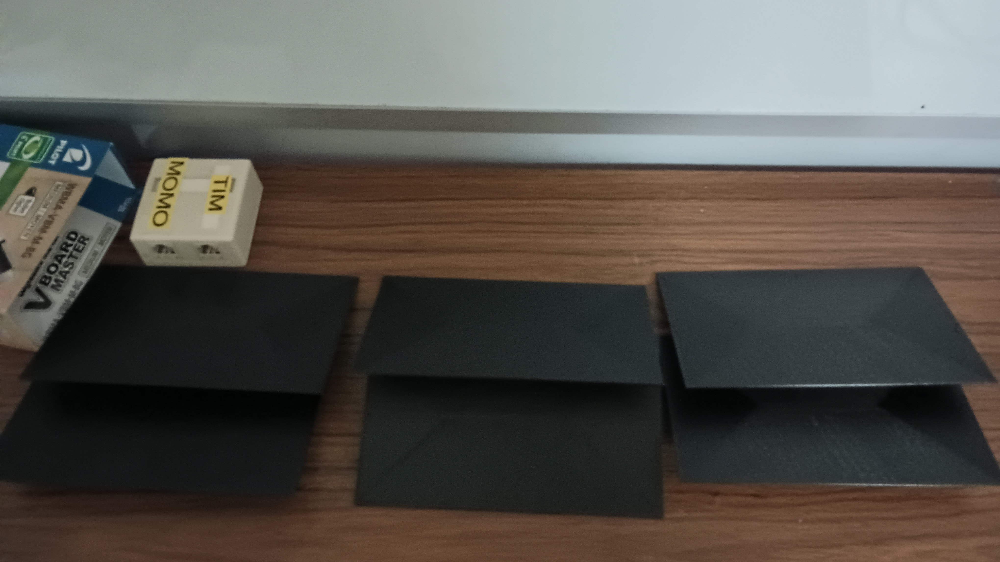
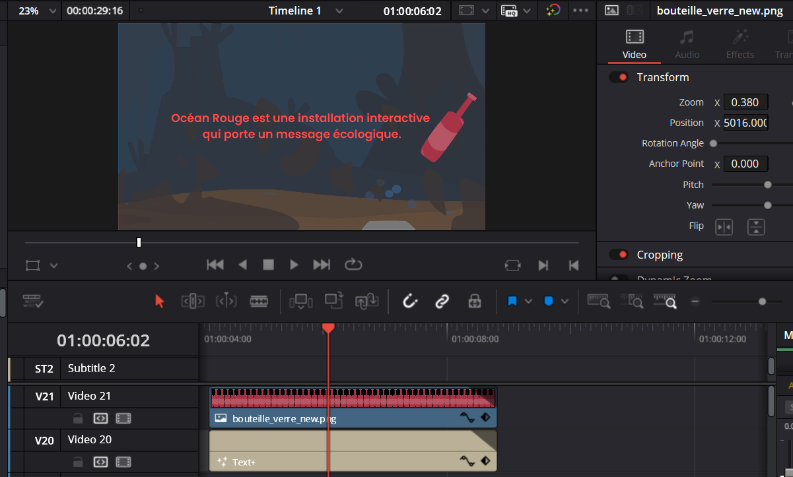

#### Mardi
- Ajout d’une limitation du nombre de déchets dans la scène
- Build du projet pour la maquette 2
- Suppression de la partie du code qui rend la scène du jeu de plus en plus sombre
- Création de la scène d’accueil avec trois panneaux pour les instructions du joystick
[Commit 24 Fevrier du projets ocean-rouge](https://github.com/deux-intelligence/dossier-du-projet/commit/9ceebf73aaed3532b6e4edf8f426ca8375bd321b)

#### Mercredi
- Mise en place de chaque sprite d’instruction du joystick dans un panel
- Codage de la désactivation des panels lorsque le mouvement montré sur le sprite de chaque panel est réalisé sur le joystick
- Ajout du changement de scène vers ocean-rouge lorsque la dernière instruction du dernier panel est réalisée sur le joystick
- Codage d’une progression de la difficulté en réduisant le délai entre la création de bouteilles en fonction du compteur
- Réparation de la zone morte en l’augmentant pour la rotation du joystick
- Ajout des panels « Gagner » et « Perdre » avec leur script où est codée leur condition d’apparition dépendant du compteur
- Codage de la limite du nombre de déchets qui peuvent être aspirés à la fois
- Retrait de l’écran de l’arcade pour pouvoir le changer ultérieurement
- Mise en place de la prochaine rencontre du comité de déambulation de la semaine 6 pour vendredi
- Création et envoi aux membres du comité de déambulation d’un formulaire à remplir pour les cartels de leur équipe
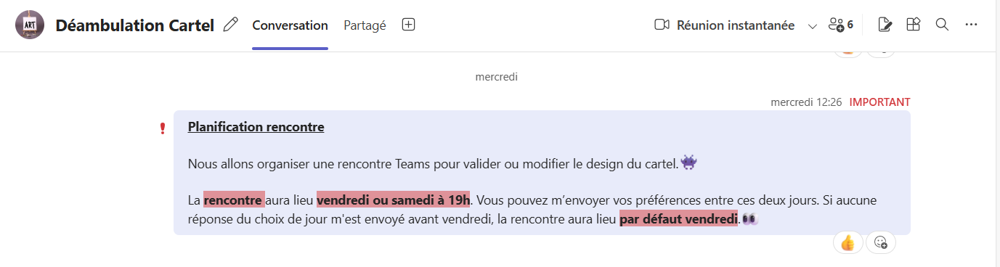
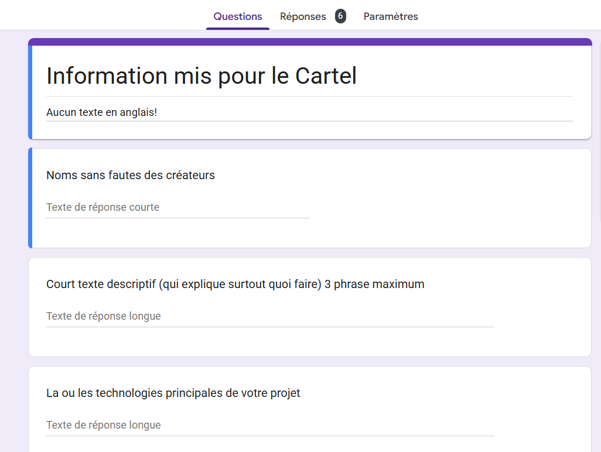
[Commit 25 Fevrier du projets ocean-rouge](https://github.com/deux-intelligence/dossier-du-projet/commit/9b0a462a6becd5d7de485067d9252b168f5de243)
[Commit 25 Fevrier du projets ocean-rouge](https://github.com/deux-intelligence/dossier-du-projet/commit/3283566670f738f3591d238c08b401f33139d897)

#### Jeudi
- Augmentation de la durée du déchet au sol avant sa destruction
- Débogage du compteur de déchets pour le réaligner avec le nombre réel de déchets présents dans la scène
- Création et envoi du formulaire des informations à inclure sur le cartel de chaque équipe pour le comité de déambulation
[Commit 26 Fevrier du projets ocean-rouge](https://github.com/deux-intelligence/dossier-du-projet/commit/9d2090bf97b851bdde7d0a9f52a0b1455900e3e7)

#### Vendredi
- Placement de trois autres plantes dans la scène de jeu et codage de leurs conditions d’apparition en fonction du compteur, tout en les faisant se mouvoir sur l’axe Y
- Placement de deux autres créatures marines (crabes et baleines) dans la scène, codage de leurs mouvements en cercle autour de la caméra, et codage de leurs conditions d’apparition en fonction du compteur, tout en les faisant se mouvoir sur l’axe Y
[Commit 27 Fevrier du projets ocean-rouge](https://github.com/deux-intelligence/dossier-du-projet/commit/4cffcbae96da0e89a950a41cbfc4a73deeed44d3)

### Semaine 6.5

#### Lundi
- Vérification de la compatibilité du nouvel écran dans l’arcade

#### Mardi
- Déplacer avec Antoine le support de l’écran pour adapter l’arcade au VESA du nouvel écran
- Codage des déchets prédéfinis pour qu’ils soient déjà au sol au début du jeu
- Ajout d’une animation de transition pour l’apparition ou la disparition d’une scène, avec un panneau passant de l’opacité 0 à 1
- Ajout de deux variantes supplémentaires pour les sons : chute de déchet au sol, aspiration et absorption de déchet, avec codage de la condition d’apparition aléatoire entre les variantes
[Commit 3 Mars du projets ocean-rouge](https://github.com/deux-intelligence/dossier-du-projet/commit/8d1fc89c3a6d4815b2701a6848f25d54f83eac46)

#### Mercredi
- Modification de la version du plan des installations de Radhouane pour une version finale
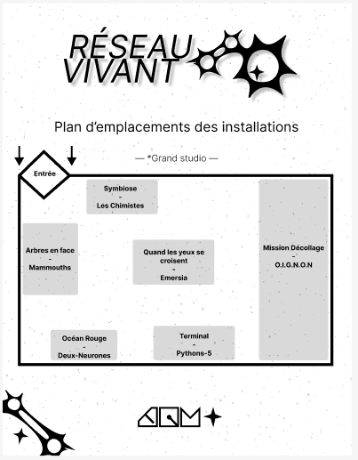

#### Jeudi
- Réparation des marges des cartels et légère modification du design pour chaque cartel
- Ajout des informations des projets pour chaque cartel
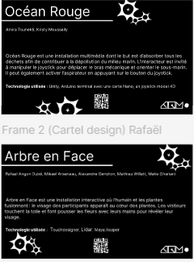

#### Vendredi
- Ajout des sons du crabe lorsqu’il se déplace pour chaque crabe, avec la condition qu’ils ne jouent que lorsque le compteur est inférieur à un certain chiffre
- Ajout des sons de la baleine, avec la condition qu’ils ne jouent que lorsque le compteur est inférieur à un certain chiffre
- Mise en place de l’animation de la baleine dans les panneaux "Gagné" et "Perdu", avec un déplacement le long de l’axe des X
[Commit 6 Mars du projets ocean-rouge](https://github.com/deux-intelligence/dossier-du-projet/commit/0d69bb51431c2253acc0826386fbc5e85cf745e6)

### Semaine 7

#### Lundi
- Codage du changement entre le texte du panneau "Tu as gagné" ou du panneau "Tu as perdu" avec les crédits
- Remplacement de l’arrêt complet du jeu lorsque le joueur gagne ou perd par l’arrêt uniquement des sons du jeu, à l’exception du son d’ambiance correspondant à la victoire ou à la défaite
- Changement de l’audio des crabes avec la nouvelle version
- Ajout de l’animation de la bouteille dans les crédits du panneau « Perdu » du jeu pour remplacer la baleine
- Ajout d’une transition lors du changement de scène à la fin du jeu, avec un panneau de transition passant au noir
- Modification des données d’apparition de chaque plante et créature en fonction du compteur, en tenant également compte de la pollution
[Commit 9 Mars du projets ocean-rouge](https://github.com/deux-intelligence/dossier-du-projet/commit/c1d0fa5d377ec815c3f2f08f8f6f679bc87d5926)
[Commit 9 Mars du projets ocean-rouge](https://github.com/deux-intelligence/dossier-du-projet/commit/d94d400805cdb9eec70bba20288af625f750bb37)

#### Mardi
- Peinture de la deuxième couche du panneau de contrôle de l’arcade
- Percer les deux trous à gauche de l’arcade pour mettre les vis du panneau de contrôle
- Ajustement du son pendant que le panneau "Gagné" ou "Perdu" apparaît pour faire arrêter les sons provoqués par l’utilisation du joystick
- Correction du design et de la taille du cartel
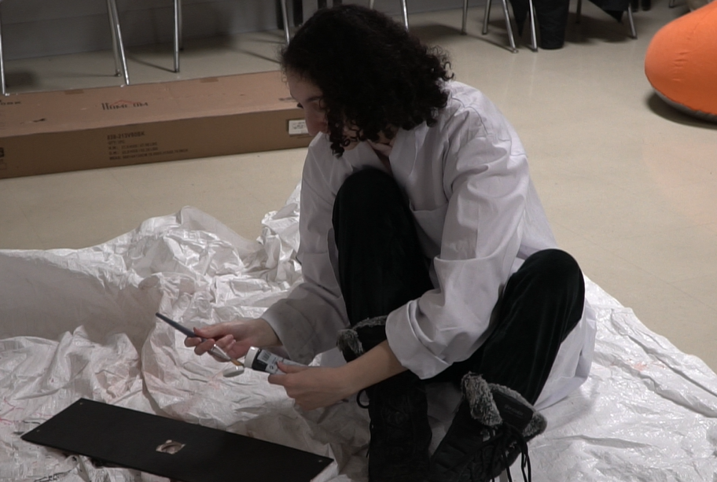
[Commit 10 Mars du projets ocean-rouge](https://github.com/deux-intelligence/dossier-du-projet/commit/3c0ce1595eb645623c5cdff0b929c6be32d98dbc)

#### Mercredi
- Réglage des sons dans l’accueil pour qu’ils ne se coupent pas et que le code attende la fin d’un son avant d’en lancer un nouveau

- Mise en place d’une introduction au début de l’accueil pour présenter le titre et une partie du jeu en fond. Pour cela, le titre du jeu est affiché avec une vidéo du jeu en arrière-plan. Après un certain temps, la vidéo et le titre passent à l’opacité 0 via une animation
[Commit 11 Mars du projets ocean-rouge](https://github.com/deux-intelligence/dossier-du-projet/commit/709295168454cf48e4f09e5f23fff170a743738f)

#### Jeudi
- Communication avec la vie étudiante et l’AGEM pour mettre sur BabiArt les affiches de l’emplacement du studio
- Impression de l’affiche de l’emplacement des installations et de l’emplacement du grand studio
- Mise en place des codes QR de chaque équipe dans leur cartel
- Correction des fautes d’orthographe dans le jeu
- Modification de l’intro pour que le manuel du bouton du joystick y soit affiché et que, lorsque le bouton est appuyé, l’intro disparaisse
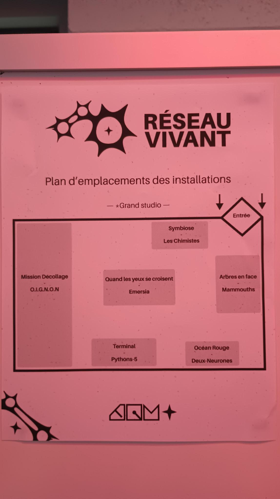
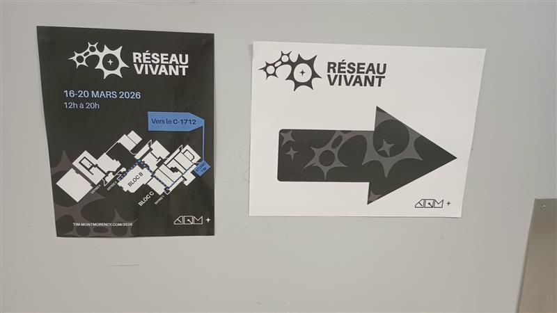
[Commit 12 Mars du projets ocean-rouge](https://github.com/deux-intelligence/dossier-du-projet/commit/b8a9df3fbef0bf8f28924feead0cc6968d3c42ea)

#### Vendredi
- Mise en place du joystick dans le panneau de contrôle
- Changement des limites du jeu pour qu’elles correspondent au trou rond du cadre de l’arcade
- Modification de la taille et de la position dans le canvas de chaque scène afin qu’elles correspondent au trou rond
- Enregistrement de l’audio de moi et Kristy qui expliquons le jeu pour la vidéo de documentation
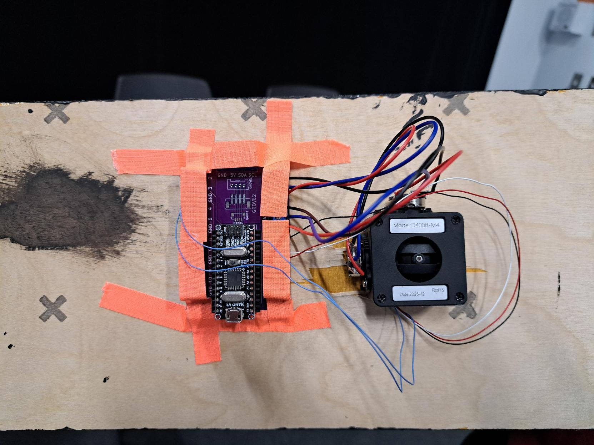
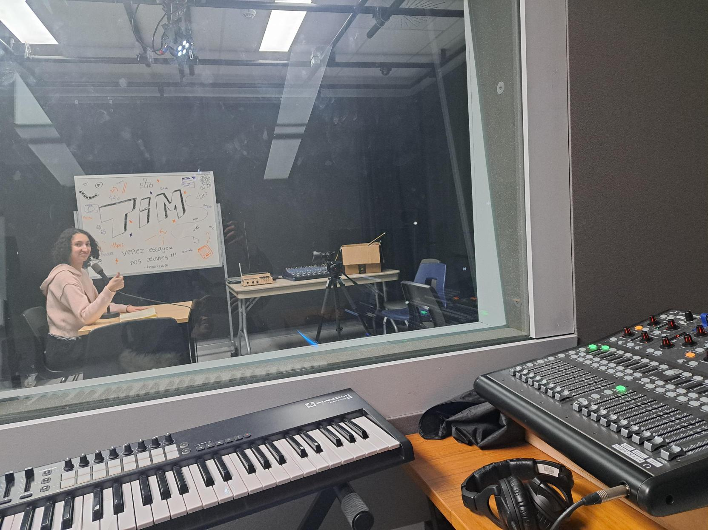
[Commit 13 Mars du projets ocean-rouge](https://github.com/deux-intelligence/dossier-du-projet/commit/d4879d767cb17acf42dac08942d027b90c0f5fa6)

### Semaine 8

#### Lundi
- Ouverture de l’installation Ocean Rouge en allumant l’écran et le build
- Modification des données en fonction de la difficulté rencontrée par les interacteurs
- Affichage du plan de l’installation
- Collage du cartel Ocean Rouge sur son support
[Commit 15 Mars du projets ocean-rouge](https://github.com/deux-intelligence/dossier-du-projet/commit/98c3adb4dcf1e6a906baffb7021f9fd9dafaf8a3)

#### Mardi
- Montage video de la video de documentation

#### Mercredi
- Ouverture de l’installation Ocean Rouge en allumant l’écran et le build

#### Jeudi

#### Vendredi
- Ouverture de l’installation Ocean Rouge en allumant l’écran et le build