# Kristy Moussally

### Semaine 1

- Création du concept du projet (expérience)
- Affinage de la partie technique (plan synoptique et plan d’implantation)
- Estimation du budget de l’équipement

### Semaine 2

- Création des assets visuels des obstacles (déchets)
- Création des assets visuels de l'interface virtuel (des bras mécanique munis d'un aspirateur)
- Création des assets visuels des créatures (poissons, tortue,...)
- Création des assets visuels du paysage (algues, roches, sable, figure de fond)

- Partage de quelques médias visuels bruts pour le prototype (maquette 1)

### Semaine 3

- Faire la réservation d'équipement et du studio pour enregistrer des sons (préparation pour la semaine 4)

- Améliorer les assets visuels pour préparer à l'animation
- Commencer les animations des assets visuels du paysage (mouvement des bras mécaniques, aspiration des objets par l’aspirateur, déchets qui coulent au fond, images de fond dynamiques et créatures marines qui nagent)

- Préparation du prototype de l'interface visuel (Communication entre l'ordinateur vers un moniteur)

- Partage des animations dans Unity (remplacement des placeholders par des éléments esthétiques)

### Semaine 4

- Réservation de l'équipement d'enregistrement et du studio pour la vidéo de bande-annonce (préparation pour la semaine 5)

- Enregistrement des sons pour les déchets, des sons mécaniques pour le sous-marin (bras mécanique + aspirateur et son exécution)
- Traitement et modification des effets sonores des sons enregistrer (créature, mécanique du sous-marin en action, déchets qui coulent au fond ) par Reaper
- Création de l'ambiance sonore par Surge XT

- Correction du visuel et aspects sonores dans Unity

### Semaine 5

- Retouchement du visuel et aspects sonores dans Unity

- Construction du cardre du moniteur (écran et fenêtre)
- Continuation de la construction de l'instalation (Cadre du moniteur)
- Installation du câblage du moniteur

- Partage des sons dans Unity (l'interaction des modules Arduino et autres éléments dynamiques du jeu)

- Rédiger une partie du dossier de presse (images, à propos de l'équipe, crédits et contact)

- Filmer et enregistrer l'interaction du projet pour la bande-annonce

### Semaine 6

- Réservation de l’équipement d’enregistrement et du studio pour la vidéo de documentation (préparation pour la semaine 6.5)

- Installation technique finale du projet

### Semaine 6.5

- Filmer et enregistrer la vidéo de documentation
- Améliorer le câblage de l'installation

### Semaine 7

- Test de contrôle de la qualité du projet (réparer les erreurs d'animation)
- Optimisation de l'application (diminuer le poids des assets visuels) (projet Unity)
- Retouche de la décoration de l’interface visuelle

### Semaine 8

- Présentation du projet (prise en charge de l’ouverture et de la fermeture du projet)
- Retouner l'équipement (vendredi)
- Désinstaller le projet (vendredi)

## Journal de bord

Cette section, complétée **quotidiennement** pendant l’exécution du projet, documente le travail individuel réellement réalisé chaque jour.

<!--
- Une entrée par jour sur 8 semaines (8 semaines à partir de la semaine 2).
   - Un total d'au moins 40 entrées uniques!
- Chaque jour :
    - Documentstion visuelle et/ou sonore du travail effectué
    - Lien vers les billets GitHub résolus
- Démarche rigoureuse de validation de la qualité
- Démonstration d'autonomie.
- Exécution technique précise et complète.
- Évaluation réfléchie de la contribution individuelle au travail d’équipe.
-->

### Semaine 2

#### Lundi

Dessiner, en vectoriel, le paysage (image de fond) avec plusieurs couches pour créer un effet parallaxe.

- Sable
- Algues (statiques)
- Cailloux
- Rocher en arrrière-plan
- Océan (image de fond)

** Le paysage devrait être une texture dans un environnement 3D (besoin Maya pour l'effet nécéssaire) **

#### Mardi

Dessiner, en vectoriel, les déchets avec plusieurs versions pour diversifier les obstacles de l'interacteur (joueur).

- bouteille en plastique
- bouteille en verre
- sac
- cannette

#### Mercredi

Communiquer l'arcade (le moniteur) via une tour (poste d'ordinateur) à l'aide d'un vidéo Extender.

Dessiner, en vectoriel, le bras mécanique muni d'un aspirateur avec plusieurs couches pour l'animation.

Redessiner, en vectoriel, les obstacles (déchets) dans Illustrator pour la taille de l'objet ainsi que de nettoyer leur design.

- Bras mécanique avec aspirateur
- bouteille en verre
- bouteille en plastique
- cannette
- sac
- Mettre à jour la liste d'équipement qu'on aura besoin pour l'arcade

#### Jeudi

Contextualiser l'esthétique sonore du projet. (paragraphe du concept sonore)

Dessiner, en vectoriel, les créatures marines et les préparer pour l'animation.

Modéliser des cylindres, dans Maya, avec la texture du paysage pour l'effet parallaxe dans Unity (module 3D en 2D).

- poissons
- tortue de mer

#### Vendredi

Animer l'aspirateur lors de l'activation (bulle entre dedans l'asppirateur).
Animer le bras mécanique qui est influencé par l'aspirateur lors de son activation (mouvement robotique).

- aspiration d'un déchet (activation)
- Mouvement du bras mécanique influencé par l'aspiration (activation)

### Semaine 3

#### Lundi

Réserver l'équipement nécessaire (portable) pour enregistrer des sons. (pour la semaine 4)

Animer le coulement des déchets dans l'océan. 

** cet animation ne serait pas utiliser à cause de la gravité dans Unity **

Animer la dégradation des déchets quand ils sont arrivés au sol de l'océan. (des bulles cachent l'objet en montant)

- bouteille en verre
- bouteille en plastique
- cannette
- sac

#### Mardi

Réserver l'équipement nécessaire (dans le petit studio) pour enregistrer des sons. (pour la semaine 4)

Redessiner, en vectoriel, le paysage dans Illustrator pour préparer à l'animation. (version dynamique)

Animer des créatures qui nagent. (en loop dans l'espace virtuel)
Mouvement fluide influencé par la technique marionnette pour la tortue.
Mouvement fluide accompagné d'une ondulation pour l'animation des poissons.

Animation de l'apparition et disparition des création. (influencer par la pollution accumuler durant le jeu)

- poissons
- tortue de mer

#### Mercredi

Débrancher la communication entre l'acarde et l'ordinateur du chariot pour les portes ouvertes. 

Preparation du projet maquette 1 (ordinateur du chariot) pour les portes ouvertes.
Nettoyer le câblage de l'ordinateur du chariot pour son déplacement au Grand studio

Animer les algues et bulles séparer du paysage / environnement pour plus de contrôle de l'interaction avec la pollution.

- mouvement des algues fluides
- bulles montent des rochers

Tester le build du projet Unity.

#### Jeudi

Modéliser les cylindres avec la texture du paysage dynamique l'effet d'immersion dans Unity (module 3D en 2D).

Déplacement du projet (ordinateur du chariot) devant le Grand studio pour les portes ouvertes.

Préparer le build du projet Unity (maquette 1) dans l'ordinateur (chariot).

#### Vendredi

Apporter l'équipement audio (portable) pour enregistrer les sons nécéssaires à la semaine 4.

Faire l'ambiance polluer (ambiance sombre sur la caméra pour donner la sensation du progression au déroulement).

Animer un signal pour montrer aux interacteurs qu'il y a des déchets hors vision.
Inspirer par le mouvement des ondes sonores et d'un radar.

Faire une liste des effets sonores à enregistrer / créer :

- bulles
- objets submergés (sac, cannette, bouteille)
- sons de machines (étirement, tourner elastique, mouvement des joints)
- aspiration (activation de l'aspirateur)
- son du signal (machine interface)
- rotation du volant (mouvement du sou-marin)
- déchets tombe sur le sable (touche le sol)
- sons des créatures marines (mouvement sous l'eau)
- déchets qui se désintégrent (qui se dégrade)
- ambiance sombre et harmonieuse

### Semaine 4

#### Lundi

Enregistrement des sons dans le petit studio.

- bulles
- eau en mouvement
- déchets (plastique, sac)
- sons mécaniques pour les bras robotiques
- aspirateur 

#### Mardi

Reséparer les parties du bras mécanique (asset visuel en plusieurs couches) pour l'exporter en PSB (photoshop vers unity)

Faire le rigging (squelette) du bras mécanique pour préparer à l'inverse kinematics dans unity. 
Faire le rigging (squelette) de l'aspirateur pour préparer à l'inverse kinematics dans unity.

Refaire l'interaction du bras mécanique dans l'espace (inverse kinematics).

Refaire l'animation des tortues en disparration au cas où l'animation de l'opacité dans unity n'est pas très fluide.

#### Mercredi

Finalizer le inverse kinematics du bras mécanique avec un cible (viseur) pour le manipuler avec le joystick.

Ajouter l'animation des bulles lors de l'aspiration (activation de l'aspirateur) dans le prefab de l'aspirateur (squelette\rig).

Corriger l'erreur de l'animation des poissons. (petite erreur de l'ondulation couper vers la fin du loop)

Séparer l'illustration de la pollution sur la fenêtre du sous-marin en différentes phases (la progression de la pollution au déroulement de l'expérience)

#### Jeudi

Travailler sur les effets sonores.

Manipuler et couper les sons enregistrés

Ajouter des effets (écho + sous l'eau).

- mouvement du bras mécanique
- activation de l'aspirateur
- déchet aspiré
- déchet touche le sable (tombe au fond)
- déchet se dégrade
- son du signal (inspirer du radar)
- découpage d'extrait de son pour préparer à l'ambiance

[Extrait sonore d'un objet absorbé par l'aspirateur](dechet_absorbe.mp3)
[Extrait sonore d'un objet qui touche le fond de l'océan](dechet_tombe_sol.mp3)

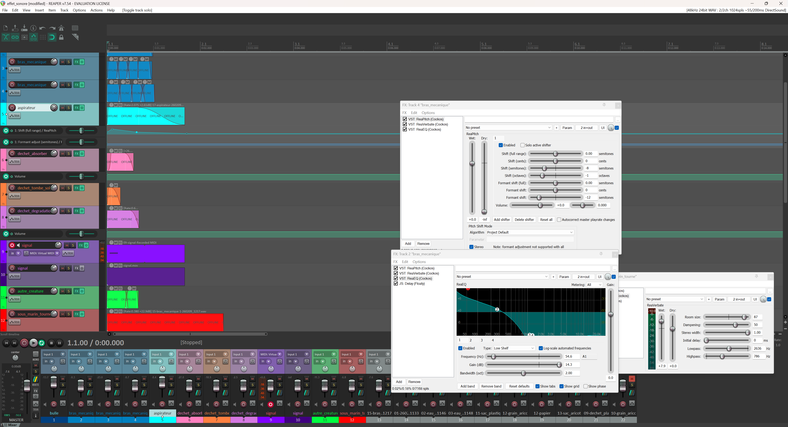

#### Vendredi

Clarifier les tâches dans le journal de bord.

Mettre à jour les tâches hebdomadaires pour préparer à les évaluations de la semaine 6.

Finaliser les effets sonores.

- mouvement du bras mécanique (avoir une différence avec la rotation du sou-marin)
- son du signal (aligner avec l'animation)
- sous-marin qui tourne (tourner le "volant")
- son de créature
- composition de l'ambiance général

[Extrait sonore des créatures marines (une partie de l'ambiance)](creatures.mp3)

[Extrait sonore du signal](signal.mp3)

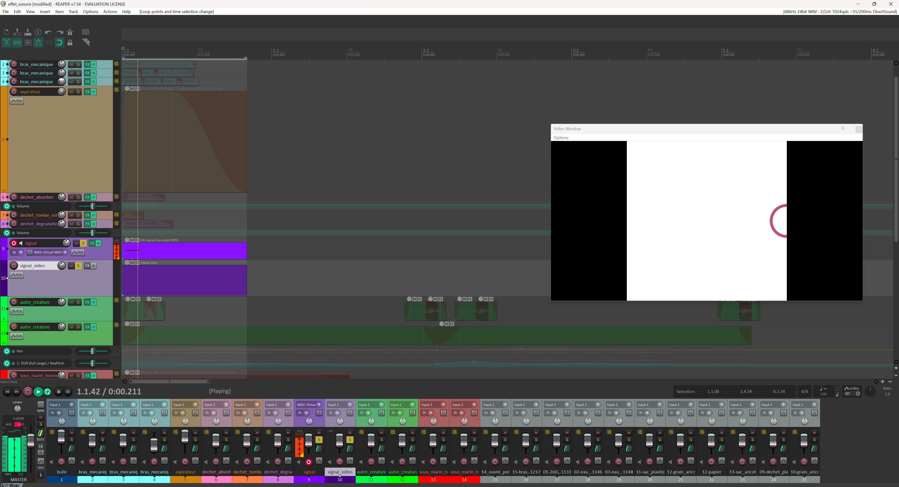

Composition de l'ambiance général dans Reaper et Wavetable. (couper et ajouter des extraits de sons)

Modéliser deux autres déchets avec la texture 2D finale pour avoir l'effet 2D dans la scène de unity (module 3D en 2D).

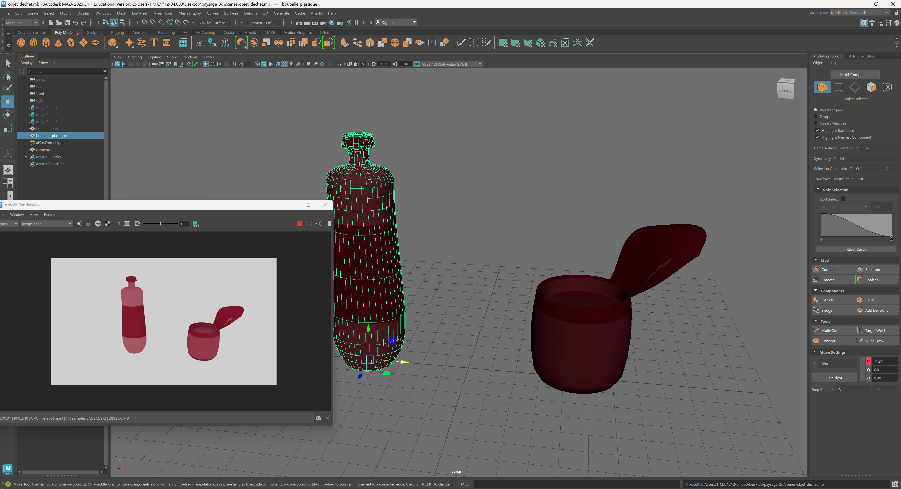

Faire une réservation pour l'équipement du montage (préparation à la bande-annonce).

### Semaine 5

#### Lundi

Mettre à jour le matérial nécéssaire pour l'arcade. (bois, module arduino)

Retouchement des effets sonores du sous-marin. Donc, mouvement du bras mécanique et rotation du caméra.

Finaliser l'ambiance général. (compiler les extraits sonores coupés et ajuster les effets)

Séparer les tracks d'ambiance sombre et l'ambiance harmonieuse.

[Extrait sonore l'ambiance - version ensemble](ambiance.mp3)

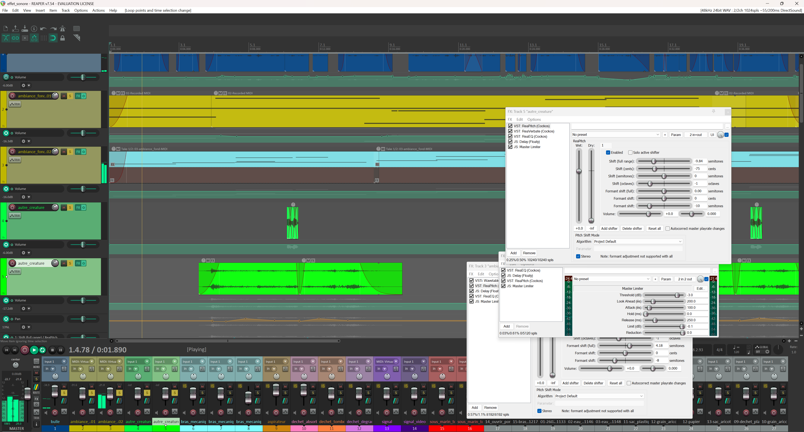

Animer les bulle pour l'animation de dégradation des déchets avec Maya.

Mettre l'animation des bulles (Baked) de Maya vers unity pour préparer à l'animation de dégradation avec les déchets.

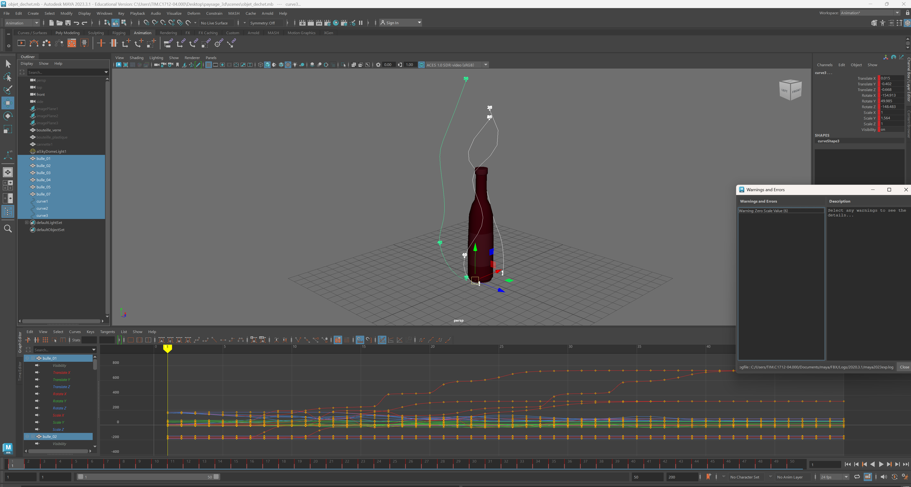
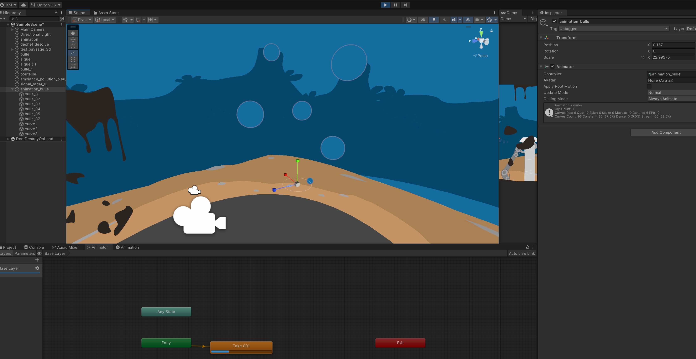

#### Mardi

Programmer les fonctionnements du joystick de 3 axis model 4D00B-M4.

Communiquer le joystick envers le pureData.

Arduino Terminal avec une carte Nano pour avoir plus de port analogue.

Le joystick contient un bouton, la rotation sur lui-même puis le contrôle des axes x et y.

- Fils rouges = 5v (voltage/power)

- Fils bleux foncés et un blanc = analogue (entré analogue des mouvements)

- Fils noirs = GND (Ground)

- Fils bleux claires = GND (Ground) et un numérique (entré numérique du bouton)

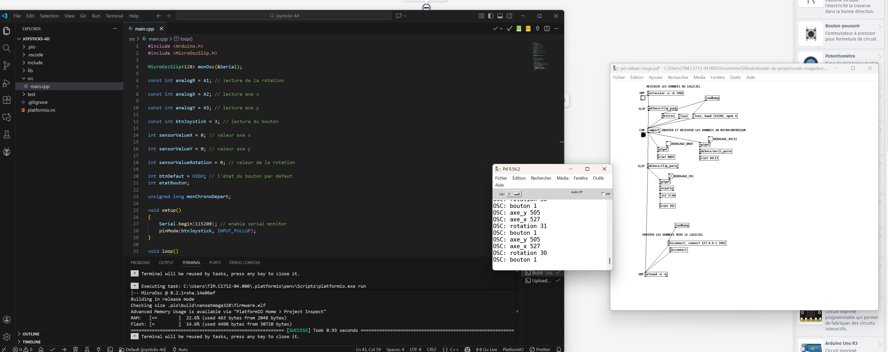
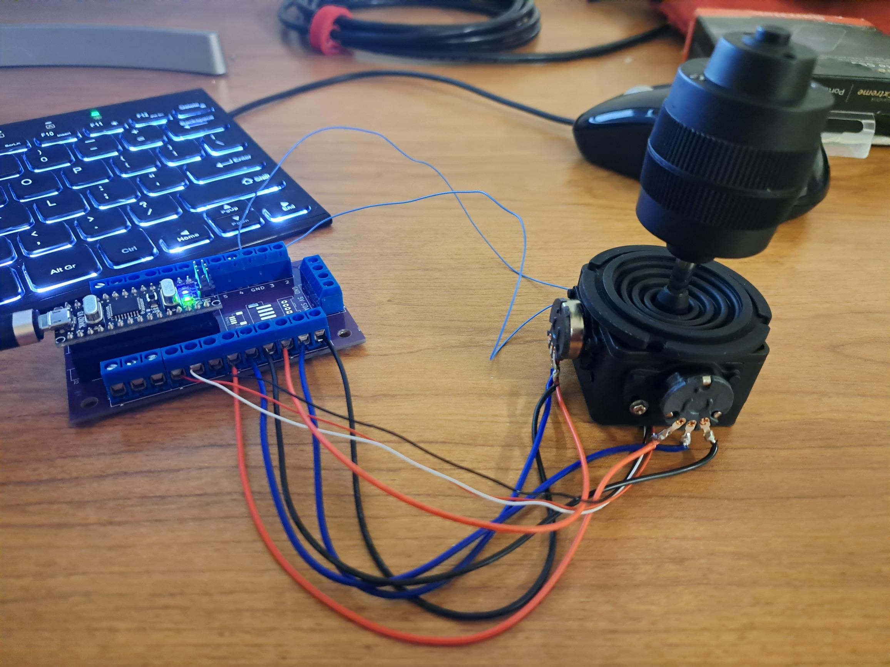
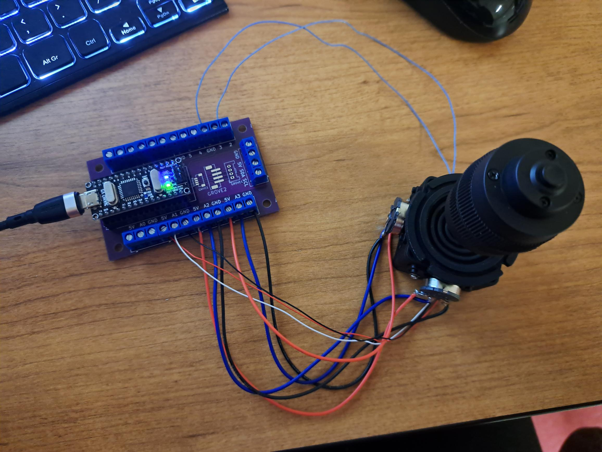

#### Mercredi

Réparer les sons de l'aspirateur lors de l'activation. (enlevé délai)

Modifier le son de la rotation de la caméra pour avoir un effet constant lors de manipulation du joystick.

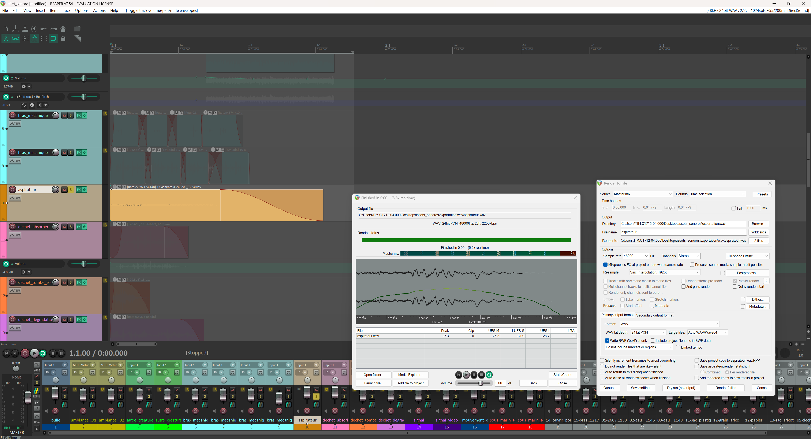

Ajouter l'animation des bulles avec les déchets dans unity.

Programmer le déclenchement l'animation de dégradation influencer avec un timer. (encore à travailler)

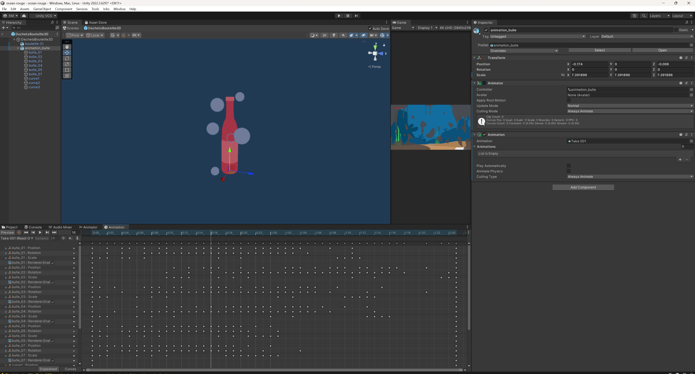

#### Jeudi

Reprogrammer le déclenchement des animations de dégradation. (bulle et déchets)

Optimiser les animations de dégradation des déchets directionement dans unity.

(Réduire la taille du code et modifier le type d'animation à Legacy pour avoir moins d'alerte dans la console)

Calibrer l'activation d'animation des déchets avec le son de dégradation.

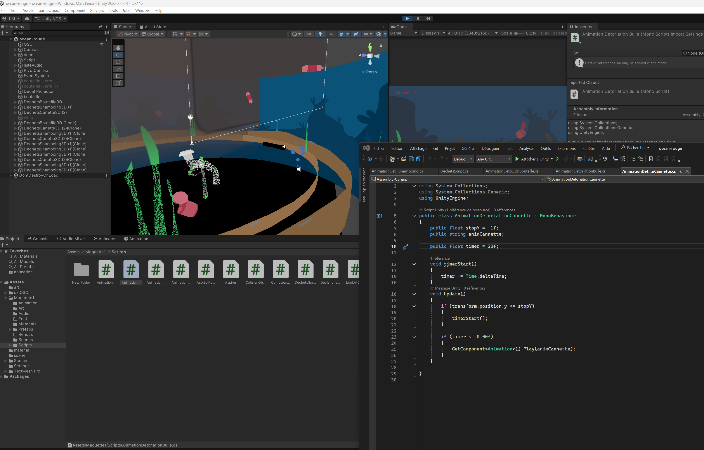

#### Vendredi

### Semaine 6

#### Lundi

#### Mardi

#### Mercredi

#### Jeudi

#### Vendredi

### Semaine 6.5

#### Lundi

#### Mardi

#### Mercredi

#### Jeudi

#### Vendredi

### Semaine 7

#### Lundi

#### Mardi

#### Mercredi

#### Jeudi

#### Vendredi

### Semaine 8

#### Lundi

#### Mardi

#### Mercredi

#### Jeudi

#### Vendredi
