# Kristy Moussally

### Semaine 1

- Création du concept du projet (expérience)
- Affinage de la partie technique (plan synoptique et plan d’implantation)
- Estimation du budget de l’équipement

### Semaine 2

- Création des assets visuels des obstacles (déchets)
- Création des assets visuels de l'interface virtuel (des bras mécanique munis d'un aspirateur)
- Création des assets visuels des créatures (poissons, tortue,...)
- Création des assets visuels du paysage (algues, roches, sable, figure de fond)

- Partage de quelques médias visuels bruts pour le prototype (maquette 1)

### Semaine 3

- Faire la réservation d'équipement et du studio pour enregistrer des sons (préparation pour la semaine 4)

- Améliorer les assets visuels pour préparer à l'animation
- Commencer les animations des assets visuels du paysage (mouvement des bras mécaniques, aspiration des objets par l’aspirateur, déchets qui coulent au fond, images de fond dynamiques et créatures marines qui nagent)

- Préparation du prototype de l'interface visuel (Communication entre l'ordinateur vers un moniteur)

### Semaine 4

- Réservation de l'équipement d'enregistrement et du studio pour la vidéo de bande-annonce (préparation pour la semaine 5)

- Enregistrement des sons pour les déchets, des sons mécaniques pour le sous-marin (bras mécanique + aspirateur et son exécution)
- Traitement et modification des effets sonores des sons enregistrer (créature, mécanique du sous-marin en action, déchets qui coulent au fond ) par Reaper
- Création de l'ambiance sonore par Surge XT

- Continuer les animations des assets visuels (mouvement des bras mécaniques, les déchets coulent au fond, les images de fond sond dynamique et créatures marines nagent)

- Construction du cardre du moniteur (écran et fenêtre)

### Semaine 5

- Retouchement du visuel et aspects sonores dans Unity

- Continuation de la construction de l'instalation (Cadre du moniteur)
- Installation du câblage du moniteur

- Partage des animations dans Unity (remplacement des placeholders par des éléments esthétiques)
- Partage des sons dans Unity (l'interaction des modules Arduino et autres éléments dynamiques du jeu)

- Filmer et enregistrer l'interaction du projet pour la bande-annonce

### Semaine 6

- Réservation de l’équipement d’enregistrement et du studio pour la vidéo de documentation (préparation pour la semaine 6.5)

- Installation technique finale du projet

### Semaine 6.5

- Filmer et enregistrer la vidéo de documentation
- Améliorer le câblage de l'installation

- Rédiger une partie du dossier de presse (images, à propos de l'équipe, crédits et contact)

### Semaine 7

- Test de contrôle de la qualité du projet (réparer les erreurs d'animation)
- Optimisation de l'application (diminuer le poids des assets visuels) (projet Unity)
- Retouche de la décoration de l’interface visuelle

### Semaine 8

- Présentation du projet (prise en charge de l’ouverture et de la fermeture du projet)
- Retouner l'équipement (vendredi)
- Désinstaller le projet (vendredi)

## Journal de bord

Cette section, complétée **quotidiennement** pendant l’exécution du projet, documente le travail individuel réellement réalisé chaque jour.

<!--
- Une entrée par jour sur 8 semaines (8 semaines à partir de la semaine 2).
   - Un total d'au moins 40 entrées uniques!
- Chaque jour :
    - Documentstion visuelle et/ou sonore du travail effectué
    - Lien vers les billets GitHub résolus
- Démarche rigoureuse de validation de la qualité
- Démonstration d'autonomie.
- Exécution technique précise et complète.
- Évaluation réfléchie de la contribution individuelle au travail d’équipe.
-->

### Semaine 2

#### Lundi

Faire le paysage (image de fond) avec plusieurs couches pour créer un effet parallaxe.

- Sable
- Algues (statiques)
- Cailloux
- Rocher en arrrière-plan
- Océan (image de fond)

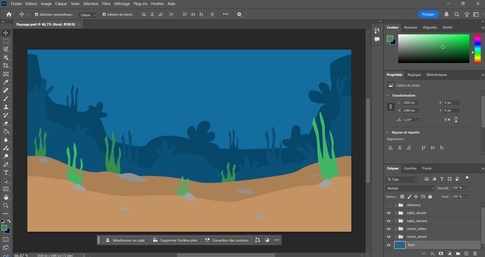
** Le paysage devrait être une texture dans un environnement 3D (besoin Maya pour l'effet nécéssaire) **

#### Mardi

Faire les obstacles (déchets) avec plusieurs versions pour diversifier le visuel.

- bouteille en plastique
- bouteille en verre
- sac
- cannette

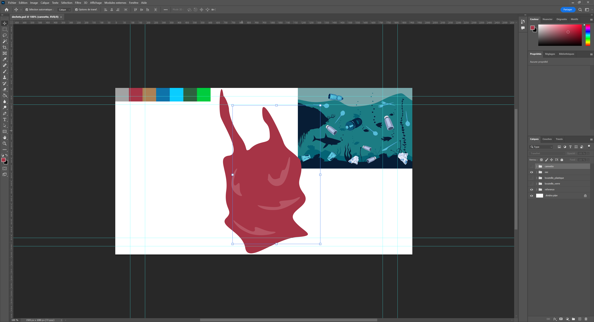

#### Mercredi

Communiquer l'arcade via une tour (poste d'ordinateur) à l'aide d'un vidéo Extender. 

Faire le bras mécanique muni d'un aspirateur avec plusieurs couches pour l'animation.

Refaire les obstacles (déchets) dans Illustrator pour la taille de l'objet.

- Bras mécanique avec aspirateur
- bouteille en verre
- bouteille en plastique
- cannette
- sac
- Mettre à jour la liste d'équipement qu'on aura besoin pour l'arcade

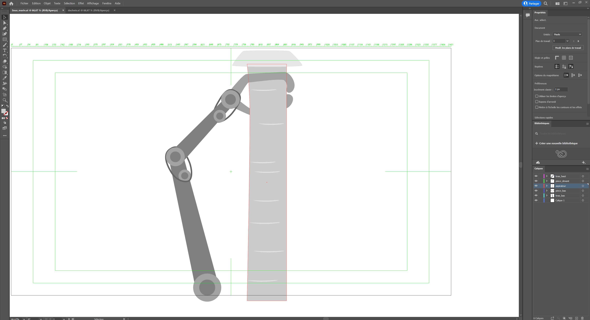

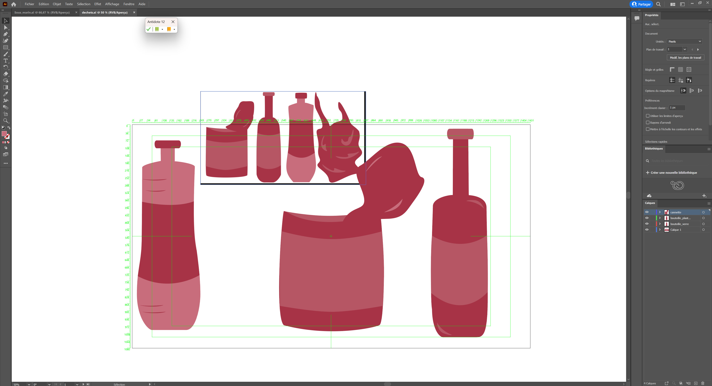

#### Jeudi

Contextualiser l'esthétique sonore du projet.

Faire les créatures marines et les préparer pour l'animation.

Création des modules 3D avec la texture du paysage pour l'effet parallaxe dans Unity (module 3D en 2D).

- poissons
- tortue de mer

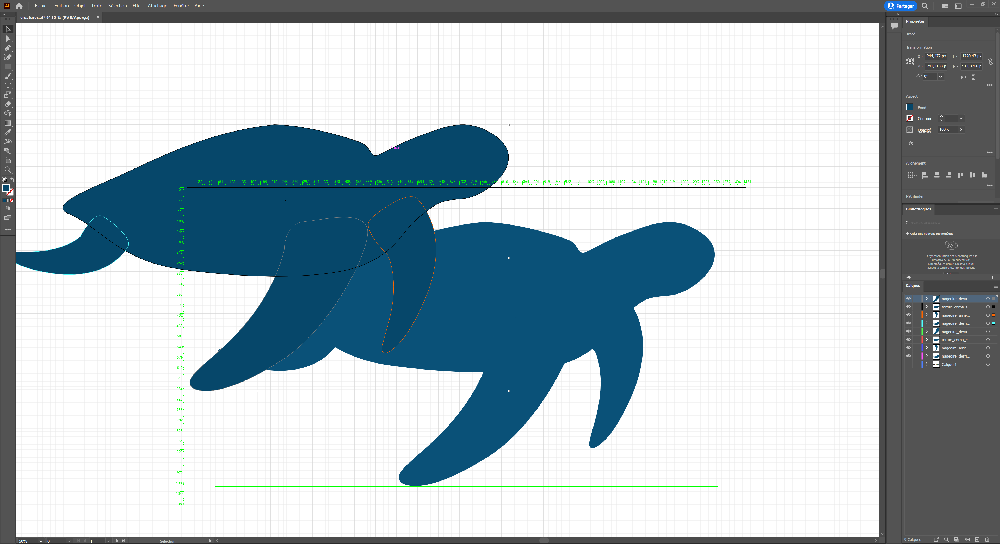
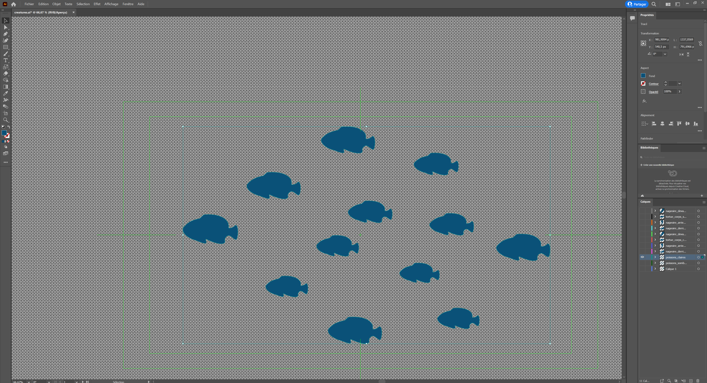
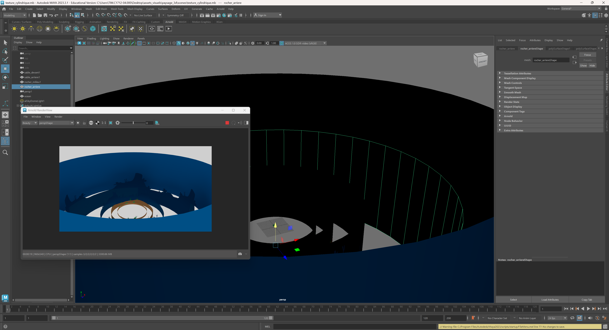
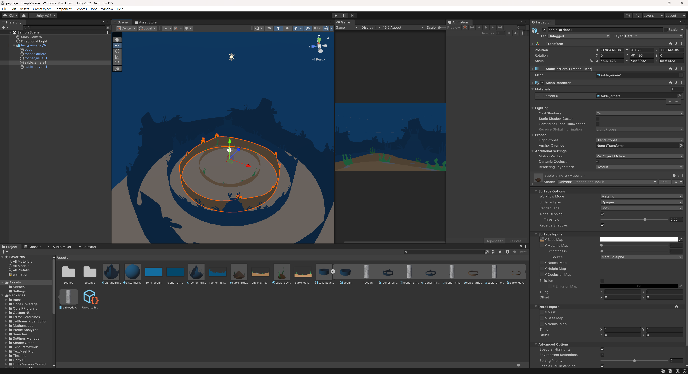

#### Vendredi

Faire l'animation de l'aspirateur.

- aspiration d'un déchet (activation)
- bras mécanique influencé par l'aspiration (activation)

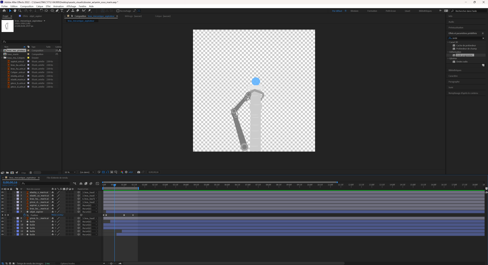
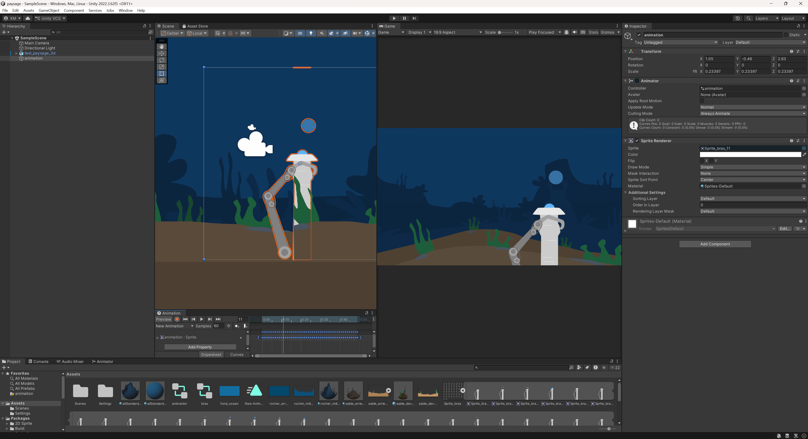

### Semaine 3

#### Lundi

Réserver l'équipement nécessaire (portable) pour enregistrer des sons. (pour semaine 4)

Faire l'animation de coulement des déchets dans l'océan.
Faire l'animation de dégradation des déchets quand ils sont arrivés au sol de l'océan.

- bouteille en verre
- bouteille en plastique
- cannette
- sac

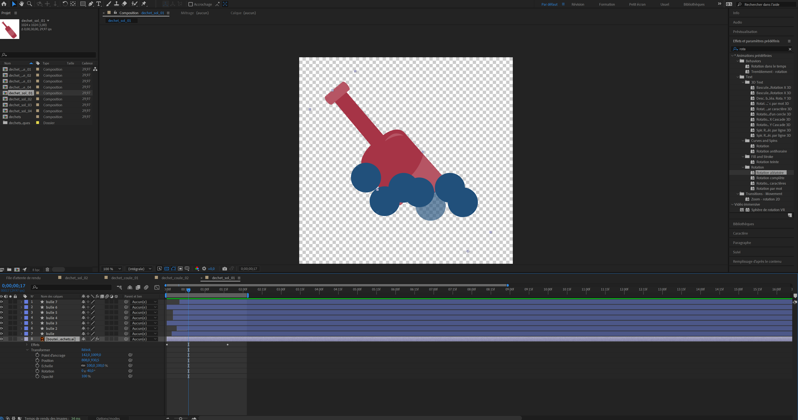
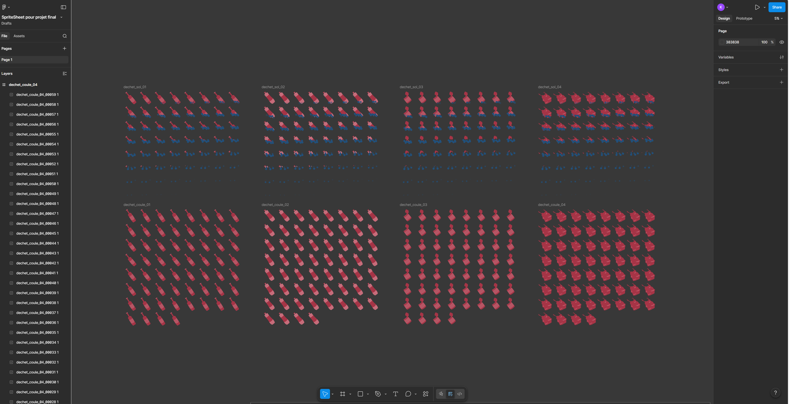
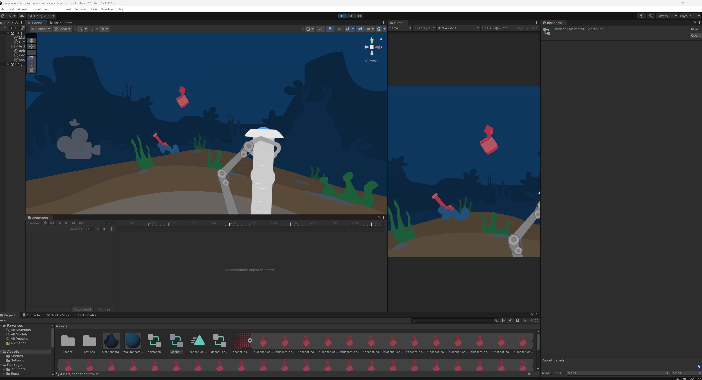

#### Mardi

Réserver l'équipement nécessaire (dans le petit studio) pour enregistrer des sons. (pour semaine 4)

Refaire le paysage dans Illustrator pour préparer à l'animation.

Faire l'animation des créatures qui nagent (scène final).
Faire l'animation de l'apparitionet disparition des création.

- poissons clairs
- poissons sombres
- tortue de mer claire
- tortue de mer sombre

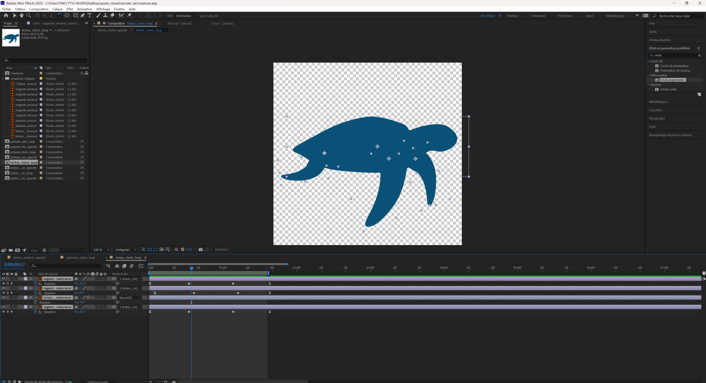
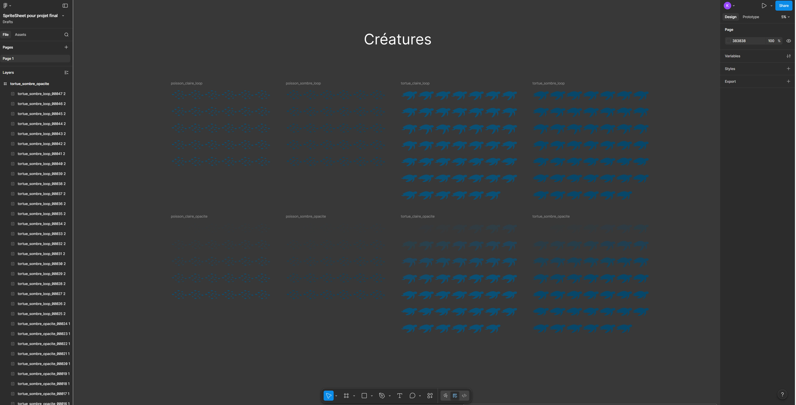
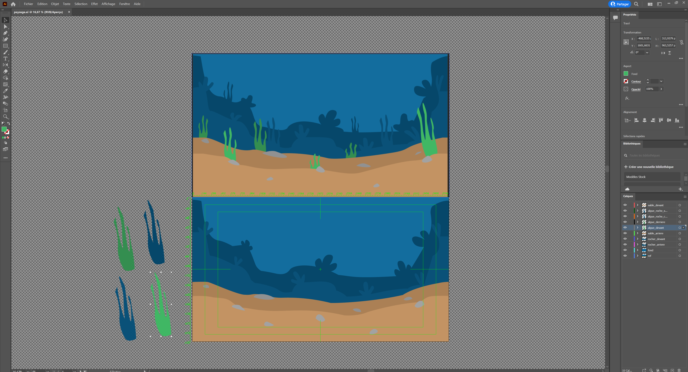
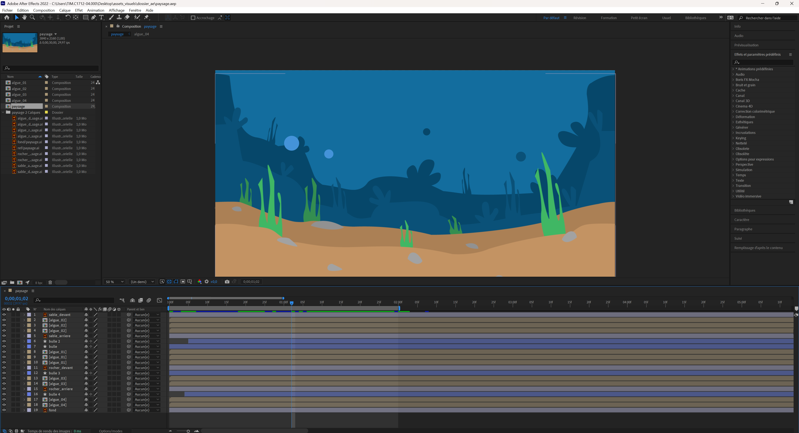

#### Mercredi

Débrancher l'acarde pour les portes ouvertes.

Preparation du projet maquette 1 (ordinateur du chariot) pour les portes ouvertes.

Faire de l'animation du paysage / environnement.

- algues
- bulles

Tester le build du projet Unity.

#### Jeudi

Retourner l'acarde pour les portes ouvertes (à l'accueil).

Création des modules 3D avec la texture du paysage dynamique l'effet d'immersion dans Unity (module 3D en 2D).

Déplacement du projet (ordinateur du chariot) au Grand studio pour les portes ouvertes.

Préparer le build du projet Unity (maquette 1).

#### Vendredi

Prendre l'équipement audio (portable) pour enregistrer les sons nécéssaires à la semaine 4.

### Semaine 4

#### Lundi

#### Mardi

#### Mercredi

#### Jeudi

#### Vendredi

### Semaine 5

#### Lundi

#### Mardi

#### Mercredi

#### Jeudi

#### Vendredi

### Semaine 6

#### Lundi

#### Mardi

#### Mercredi

#### Jeudi

#### Vendredi

### Semaine 6.5

#### Lundi

#### Mardi

#### Mercredi

#### Jeudi

#### Vendredi

### Semaine 7

#### Lundi

#### Mardi

#### Mercredi

#### Jeudi

#### Vendredi

### Semaine 8

#### Lundi

#### Mardi

#### Mercredi

#### Jeudi

#### Vendredi
