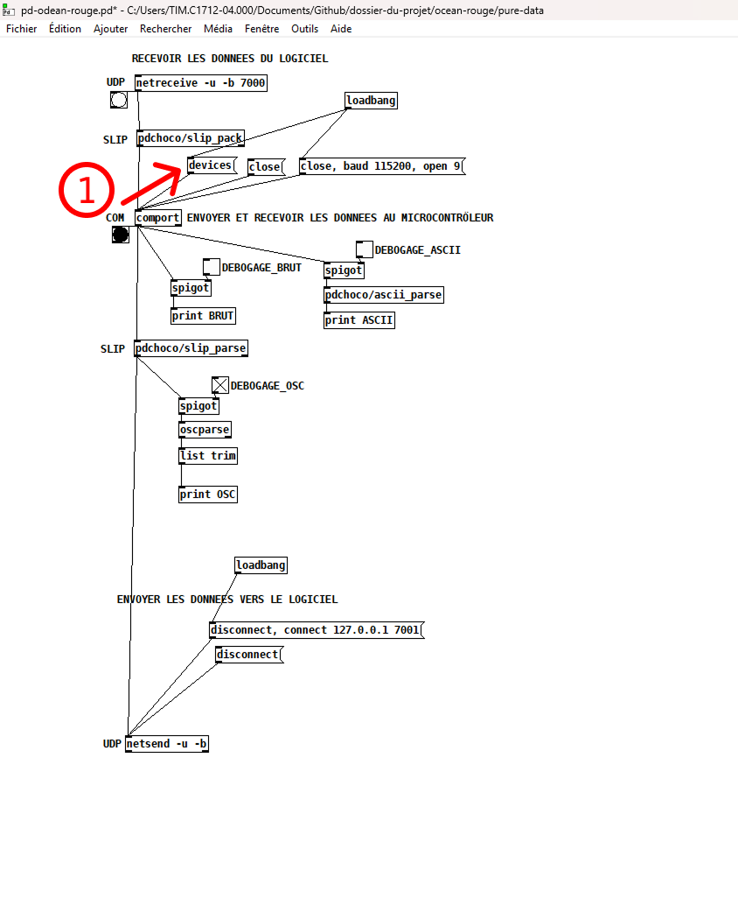
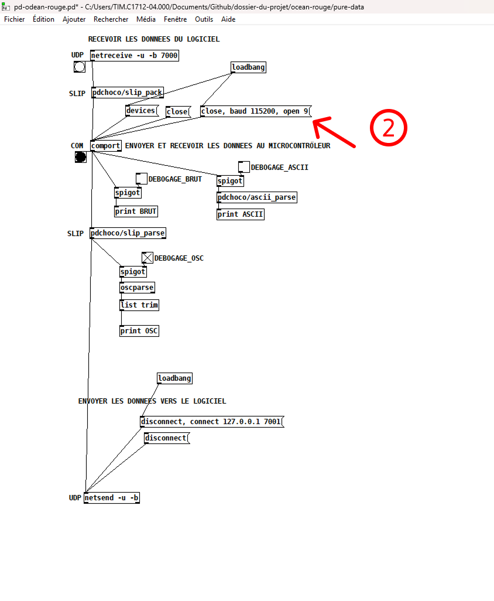
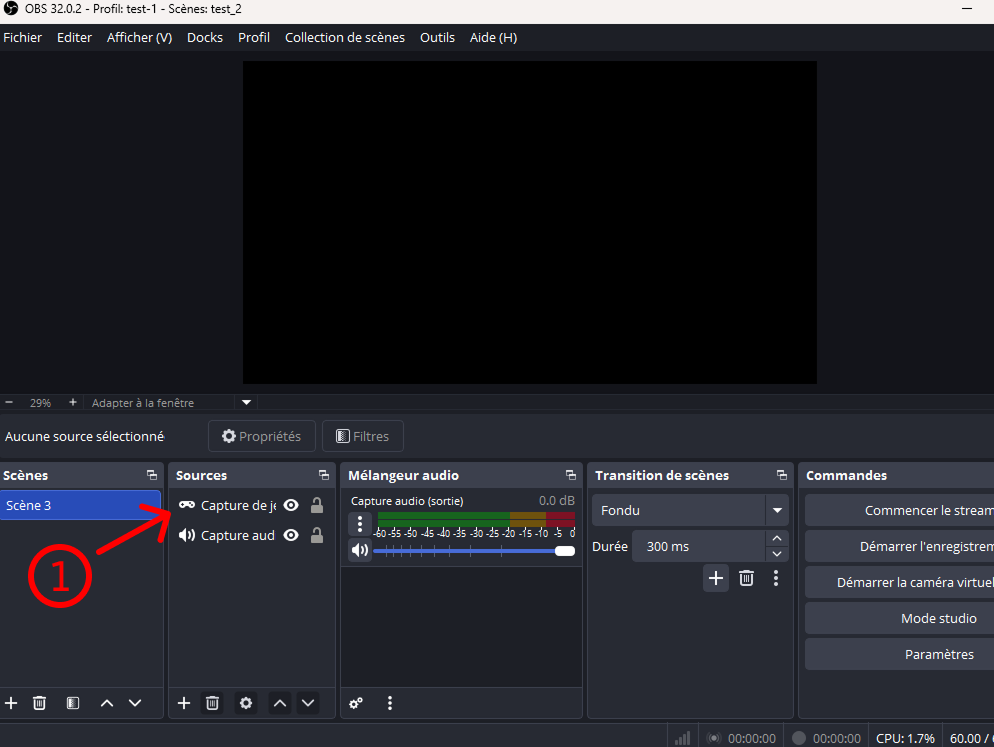
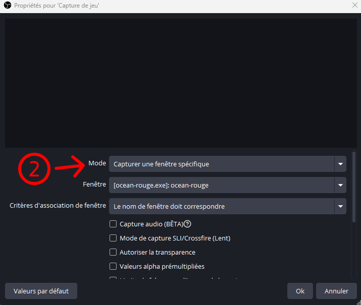
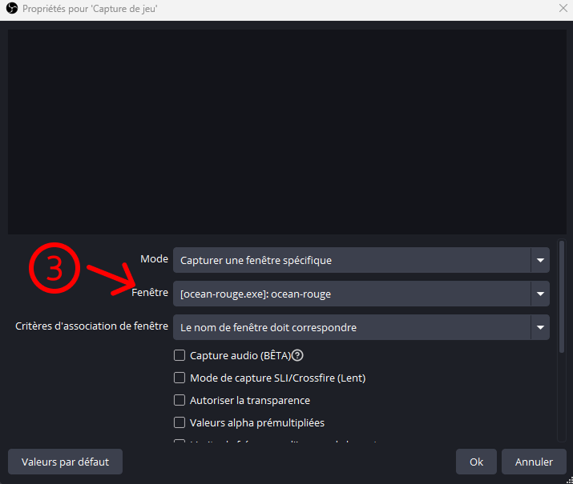
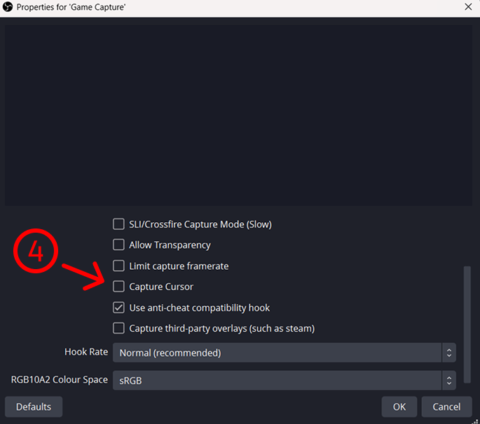
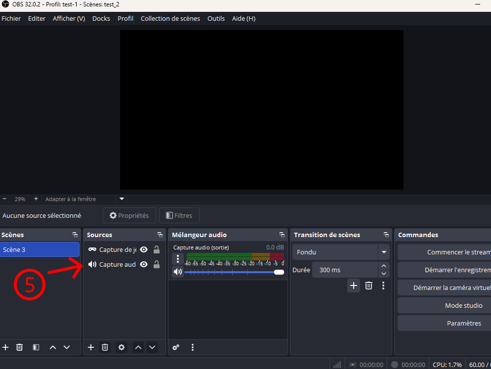
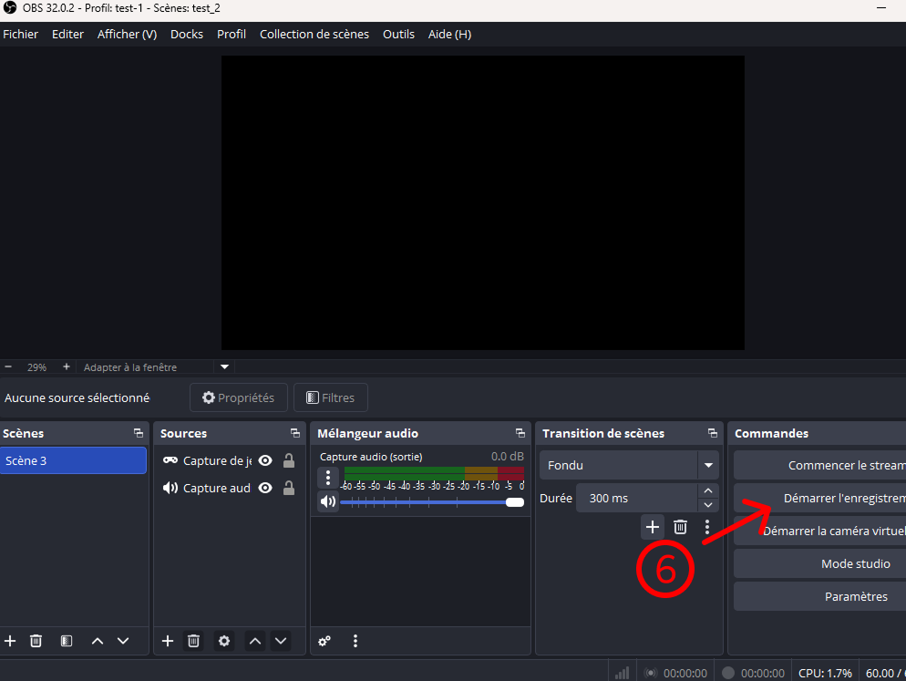
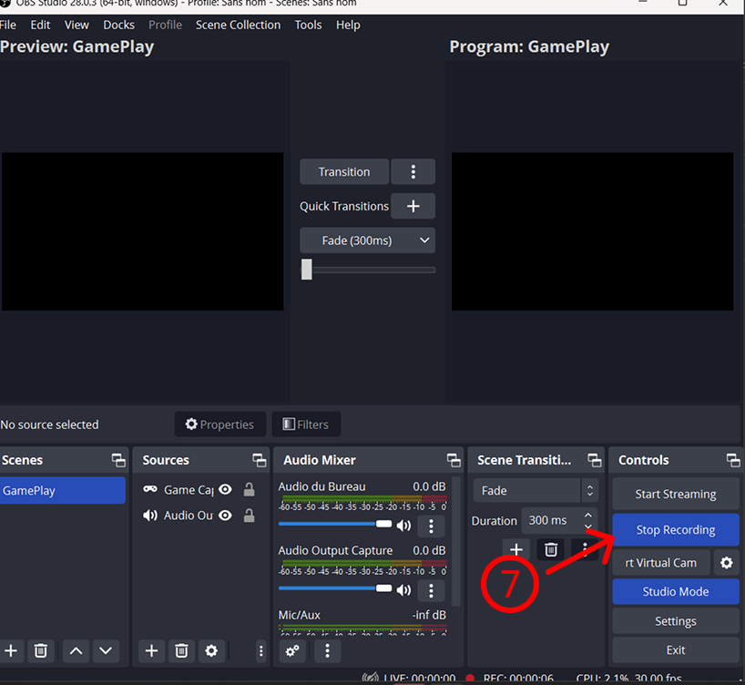
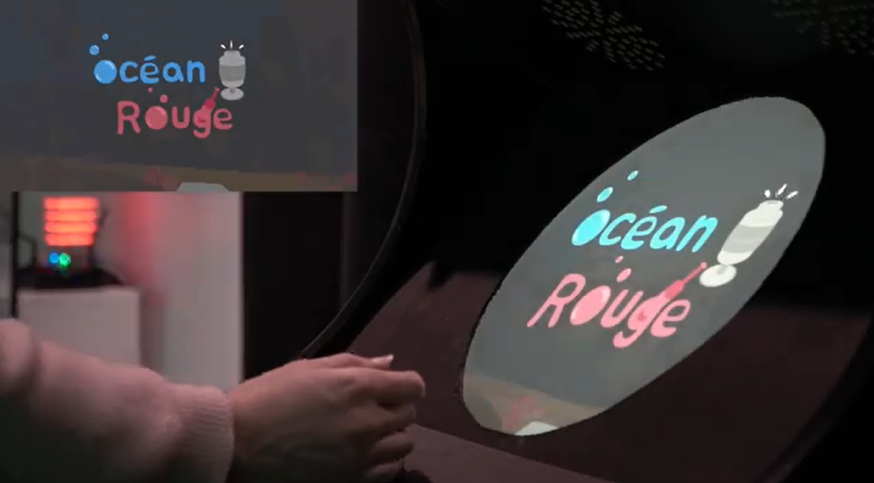

# Exposition

Cette section documente l'exposition publique du projet.

## Permanence

Ce tableau indique les responsables quotidiens de l’exposition, désignés par chaque équipe pour assurer la permanence pendant la semaine.

| Jour     | Responsable |
| -------- | ----------- |
| Lundi    | Amira       |
| Mardi    | Kristy      |
| Mercredi | Amira       |
| Jeudi    | Kristy      |
| Vendredi | Amira       |

## Procédure d’ouveture quotidienne

Cette section décrit les étapes nécessaires pour ouvrir l’installation chaque matin.
Elle a pour objectif de garantir une mise en place cohérente, sécuritaire et fidèle au projet, quel que soit le responsable de permanence.

1. Ouvrir le logiciel pureData
2. Activer la communication "devices" du PureData

   

3. Assurer que l'application ouvre le bon port (ex.: COM 9) puis clicker sur

   ** Vérifier le port USB dans le gestionnaire de périphériques **

   

4. Télécharger le build du projet -> "build_maquette_final.zip"
5. Dézipper le dossier "build_maquette_final.zip"
6. Ouvrir l'application "ocean_rouge.exe"

### Pour enregistrer l'interaction du jeu

1. Ouvrir le logiciel OBS
2. Ajouter "Capture de jeu" dans la zone source de la scène

   

3. Mettre le mode en "Capture une fenêtre spécifique"

   

4. Mettre la fenètre capturée le jeu unity -> "ocean-rouge.exe"

   

5. Décocher l'option de voir le curseur durant l'enregistrement

   

6. Ajouter "Capture d'audio" dans la zone source de la scène

   

7. Assurer que le "Capture d'audio" prend la sortie du jeu et non les haut-parleurs
8. Enregistrer le "gameplay"

   

### Procédure de fermeture quotidienne

1. Fermer la fenêtre du jeu
2. Arrêter l'enregistrement d'OBS

   

3. Fermer la communication du pureData

   

<!--
Chaque composante de l’installation est détaillée ci-dessous avec :
- une description,
- les étapes d'ouverture
- des liens utiles,
- des photos de référence.
-->

## Documentation vidéo finale

<!-- Intégration d’une vidéo : méthode 1 (vidéo hébergée sur YouTube, pouvant être non répertoriée publiquement)
-->

<!-- Intégration d’une vidéo : méthode 2 (vidéo locale)
 -->
<!--
 
-->
