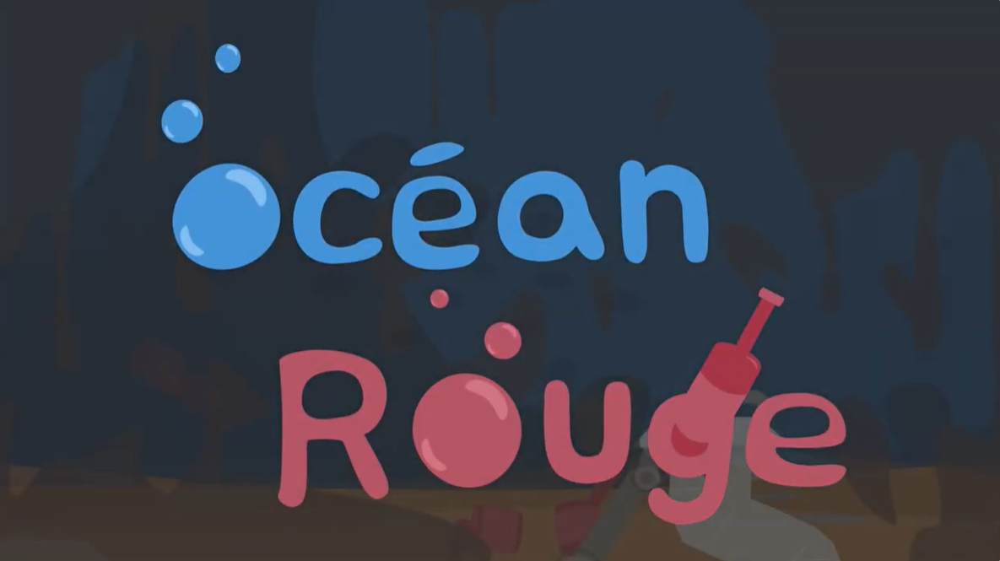
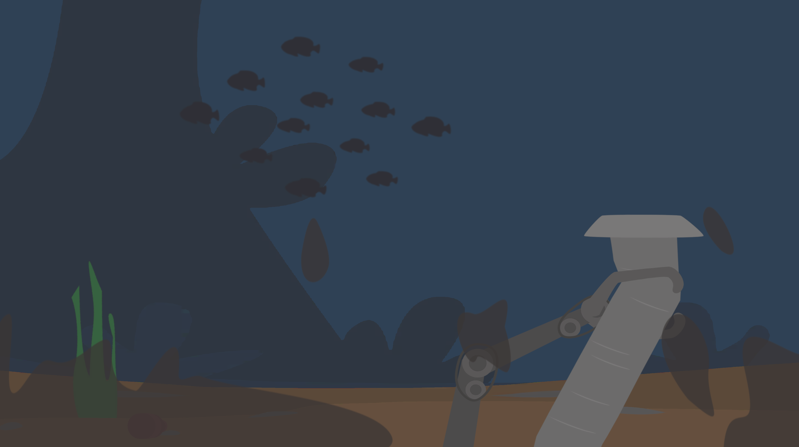
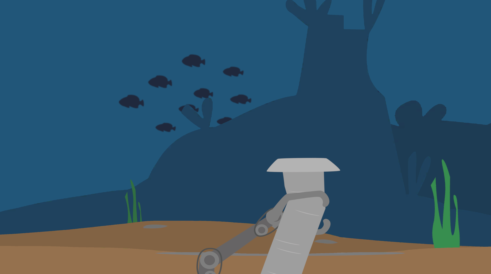
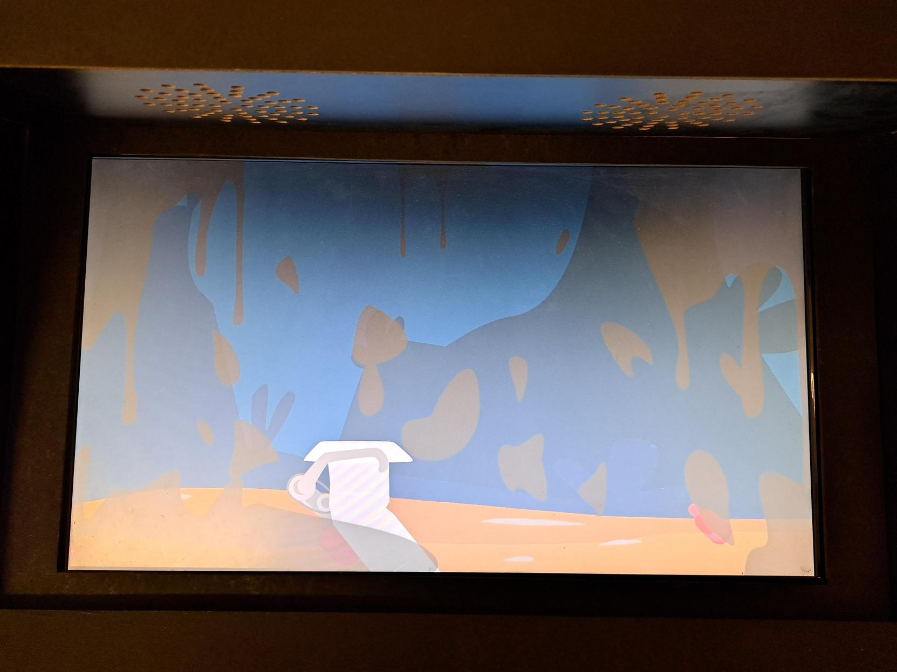

# Dossier de presse

## Fiche d’informations

**Développeur :**  
[Programme de Techniques d'intégration multimédia du Collège Montmorency](https://tim-montmorency.com/)

**Date de présentation :**  
Du 16 au 20 mars 2026.

**Forme :**  
Installation interactive

**Site Web du projet :**  
[tim-montmorency.com/momo_modele-site-projet-etudiant_25-26](https://tim-montmorency.com/momo_modele-site-projet-etudiant_25-26/#/)

**Site Web de l'exposition collective :**  
[6tim-montmorency.com/2026](https://tim-montmorency.com/2026/#/)

**Prix :**  
Gratuit

## Description

Nous avons conçu une installation sur le thème de la pollution des océans, intitulée <b>Océan Rouge</b>. Nous souhaitons, à travers une expérience interactive, transmettre l’inaction sous-jacente face à la mort lente de l’écosystème océanique, montrant une population qui détourne les yeux face à la production excessive de déchets.

## Histoire

À deux, nous voulions créer un projet réalisable tout en ayant un lien avec l’actualité de nos vies sur Terre, un sujet auquel tout le monde pourrait se sentir concerné. C’est dans cette optique que notre choix s’est porté sur la dégradation de notre planète à cause de la pollution. Nous voulions choisir une esthétique calme qui contrasterait avec l’abondance d’objets et de saleté. Nous avons donc choisi l’océan pour son calme et sa sobriété.

Au départ, notre projet visait à montrer un collectif de personnes qui s’entraidaient. Cependant, nous nous sommes rendu compte que notre projet pouvait tout autant porter notre message à travers une seule personne. Notre message repose sur le choix que l’on accorde à réagir ou non face à la souffrance de notre écosystème.

## Fonctionnalités

Notre installation interactive est équipée d’un joystick 4D, permettant à l’utilisateur de cliquer sur un bouton, de déplacer le joystick sur les axes X et Y, et de le faire tourner sur lui-même. Les modifications des mouvements du joystick permettent de déplacer le bras mécanique à l’écran, ce qui offre, grâce au bouton, la possibilité de saisir les différents déchets en mouvement. Le joystick permet également, grâce à sa rotation, de déplacer la caméra de la scène, offrant ainsi une immersion plus grande dans l’environnement océanique. Chaque interaction provoquée par le joystick ajoute une multitude de sons à l’environnement sonore sous-marin de <b>Océan Rouge</b>.

## Bande-annonce

<!-- Intégration d’une vidéo : méthode 1 (vidéo hébergée sur YouTube, pouvant être non répertoriée publiquement)
-->

<!--

-->

<!-- Intégration d’une vidéo : méthode 2 (vidéo locale)
 -->
<!--
 
-->

## Images

<!-- Autres sections d'un dossier de presse, moins pertinentes pour ce projet
## Logo & Icône
## Prix et reconnaissances
## Articles sélectionnés
 -->

## À propos de l'équipe de création

Nous sommes une équipe de finissantes en technique d’intégration multimédia. Nous mettons à profit nos connaissances afin d’approfondir notre vision artistique à travers de nouvelles plateformes technologiques.

Notre équipe s’inspire de problématiques environnementales, notamment la pollution. Nous invitons les interacteurs à faire face aux conséquences du manque de responsabilité envers les déchets qui nuisent à l’environnement naturel.

## Crédits

Amira Tounekti : Programmation, communication technique et construction du panneau de contrôle.

Kristy Moussally : L’installation, création des assets visuels et sonores.

## Contact

[ Lien Linkedln vers Amira Tounekti](https://www.linkedin.com/in/amira-tounekti-25766b397/)

[ Portfolio d'Amira Tounekti](https://terresteur.github.io/portfolio-amira-tounekti/index.html)

[ Lien Linkedln vers Kristy Moussally](https://www.linkedin.com/in/kristy-moussally-83565b397/)

[ Portfolio de Kristy Moussally](https://kristymoussally.github.io/portfolio/)
