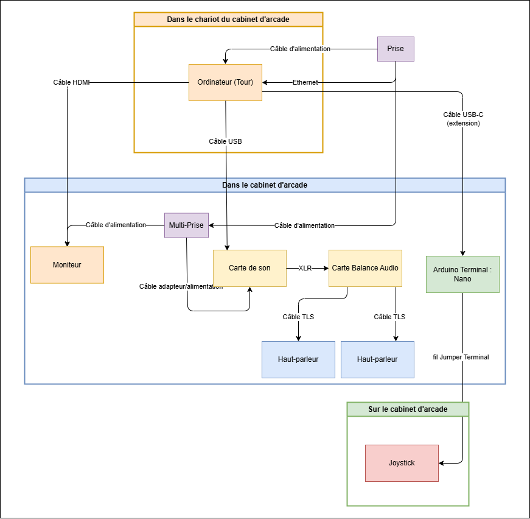
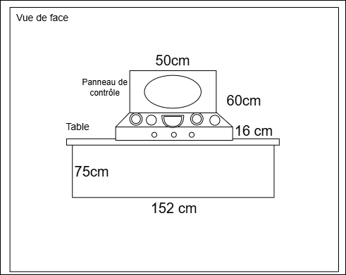
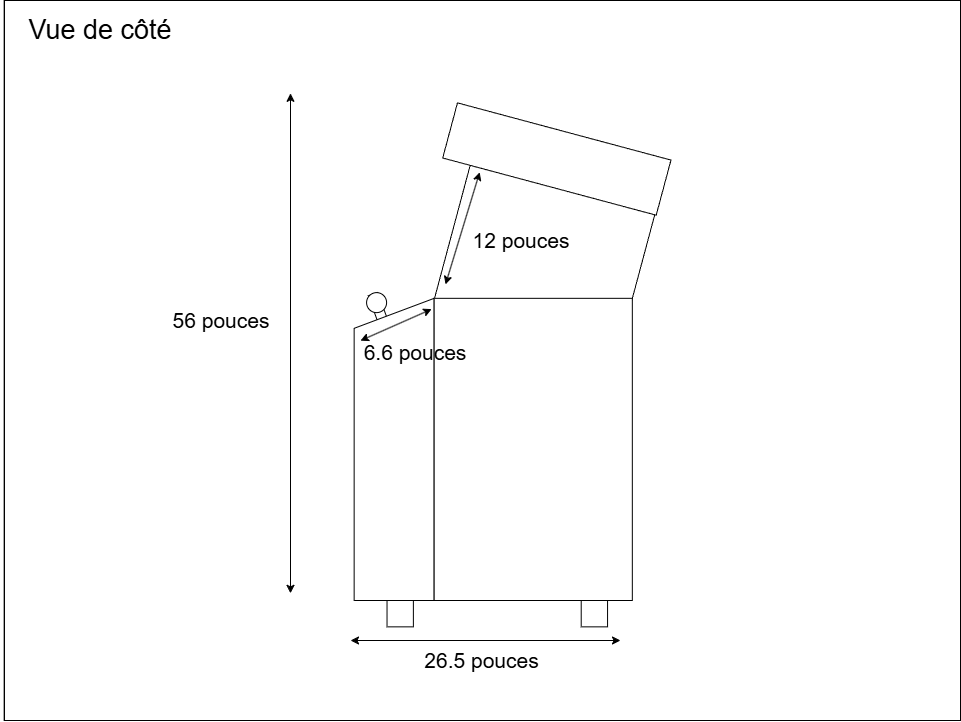
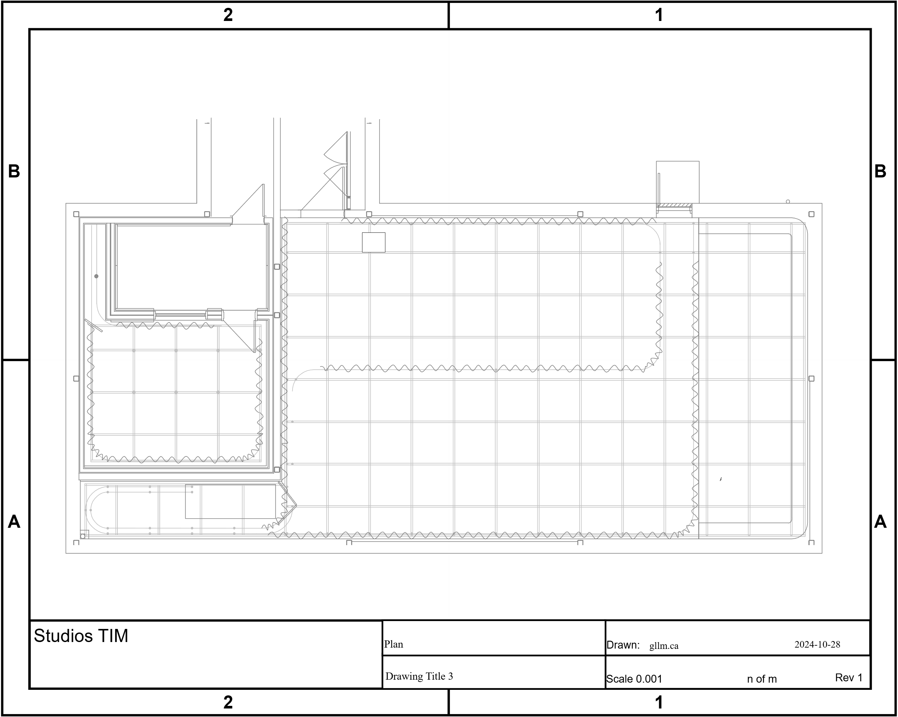
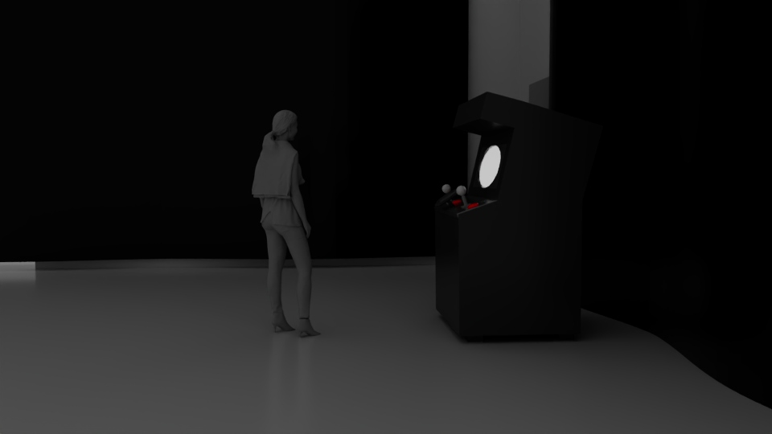
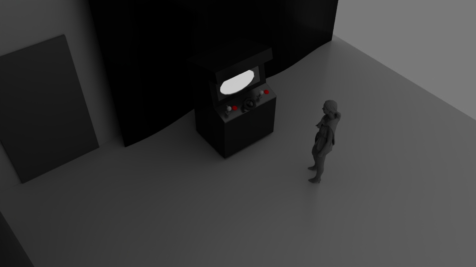

# Technique

## Équipements

### Équipements générals

| Nom d'équipement     | Quantité |                            Fonction                            | Offert par le Programme |
| :------------------- | :------: | :------------------------------------------------------------: | ----------------------: |
| Ordinateur           |    1     |    Poste source / Traitement du fonction de l'installation     |                     oui |
| Câble Ethernet       |    5     |        Connecter l'ordinateur et les Atoms à l'ethernet        |                     oui |
| Câble d'alimentation |    2     |               Alimenter l'ordinateur et l'écran                |                     oui |
| Câble HDMI           |    1     |              Connecter l'ordinateur vers l'écran               |                     oui |
| Table                |    1     | Support le panneau de contrôle (éléments tangibles) et l'écran |                     oui |
| Nappe en plastique   |    1     |         Fenêtre transparent pour observer le moniteur          |                     non |
| Peinture en aérosol  |    2     |        Décoration pour de l'interface pour la cohérence        |                     non |
| Cadre photo ovale    |    1     |             Décoration pour la fenêtre hublot oval             |                     non |

### Équipements visuels

| Nom d'équipement     | Quantité |             Fonction              | Offert par le Programme |
| :------------------- | :------: | :-------------------------------: | ----------------------: |
| Moniteur             |    1     |     Afficher l'espace virtuel     |                     oui |
| Câble d'alimentation |    1     | Alimenter l'ordinateur et l'écran |                     oui |

### Équipements sonores

| Nom d'équipement | Quantité |                     Fonction                     | Offert par le Programme |
| :--------------- | :------: | :----------------------------------------------: | ----------------------: |
| Cabinet d'arcade |    1     | Station de l'installation avec des haut-parleurs |                     oui |

### Équipements interaction

| Nom d'équipement      | Quantité |                                  Fonction                                   | Offert par le Programme |
| :-------------------- | :------: | :-------------------------------------------------------------------------: | ----------------------: |
| Câble USB-C           |    3     |           Compiler le programmation de l'interaction (Atom Lite)            |                     oui |
| Atom PoE              |    3     | Alimenter les Atom Lite à l'Ethernet (au cas déconnection via l'ordinateur) |                     oui |
| Atom Lite             |    3     |              Connecter les objets manipulables à l'ordinateur               |                     oui |
| PbHub                 |    2     |               Connecter tous les éléments d'arduino ensemble                |                     oui |
| Grove Arduino         |    3     |              Connecter le angle unit et Joystick à l'Atom Lite              |                     oui |
| Encoder               |    1     |  Donner les données de la rotation du sous-marin via le volant vers unity   |                     oui |
| Joystick              |    2     |        Donner les données de la position de l'aspirateur vers unity         |                     oui |
| Bouton Arcade         |    3     |                Exécuter l'action de l'aspirateur vers unity                 |                     oui |
| VH3.96 - 4pin Arduino |    6     |                 Connection des joysticks et boutons Arcade                  |                     oui |
| Volant                |    1     |                    Manipulater la rotation du sous-marin                    |                     non |

## Logiciels

| Nom des logiciels  |                                Fonction                                | Offert par le Programme |
| :----------------- | :--------------------------------------------------------------------: | ----------------------: |
| Illustrator        |     Création de l'environnement et médias (déchets, créatures,...)     |                     oui |
| After Effects      |                    Création d'animation des médias                     |                     oui |
| Reaper             |                      Création des effets sonores                       |                     oui |
| Surge XT           |                     Création de l'ambiance sonore                      |                     oui |
| Unity              |     Simulation de l'activité ludique (traitement visuels/sonores)      |                     oui |
| Studio Visual Code |                     Programmation de l'interaction                     |                     oui |
| PureData           | Communication du programmation de l'interaction vers le visuel virtuel |                     oui |
| Github             |   Organisation et hébergement du code et médias de l'oeuvre entière    |                     oui |

## Synoptique

## Plans

### 2D

### 3D

## Budget

| Nom                 | Quantité | Prix unitaire | Coût total |                   lien |
| :------------------ | :------: | :-----------: | :--------: | ---------------------: |
| Cadre photo ovale   |    1     |    32,00 $    |  32,00 $   | https://urls.fr/9W_Vz0 |
| Nappe en plastique  |    1     |    16,00 $    |  16,00 $   | https://urls.fr/6dSbLK |
| Peinture en aérosol |    2     |    26.00 $    |  52,00 $   | https://urls.fr/5gQY80 |
| Volant              |    1     |    24,00 $    |  24,00 $   | https://urls.fr/7NgmXv |
| Résultat Total      |          |               |   124 $    |                        |
